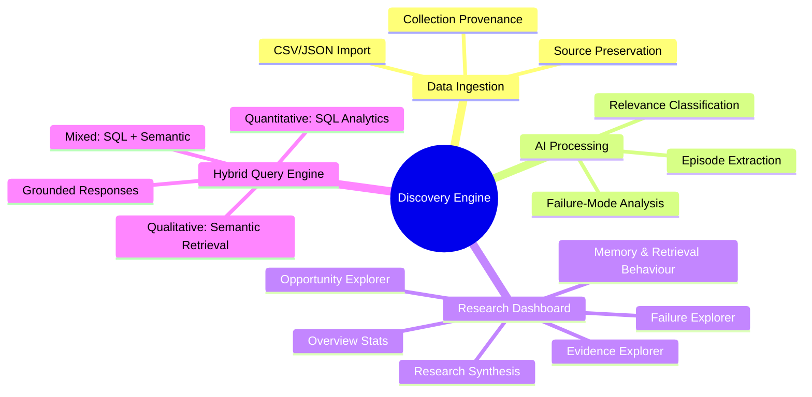
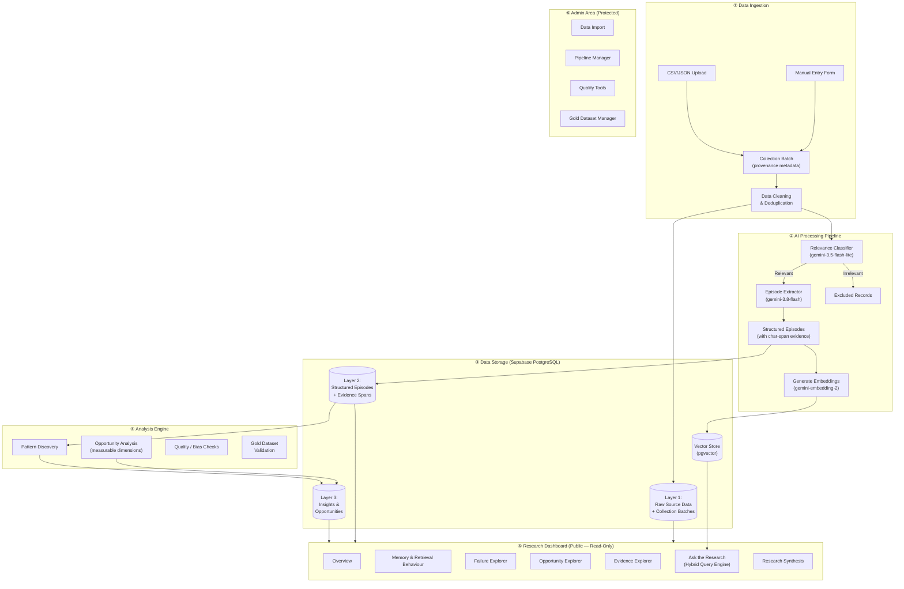
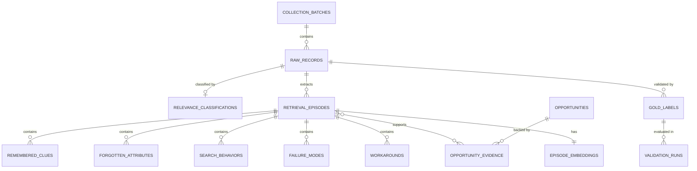
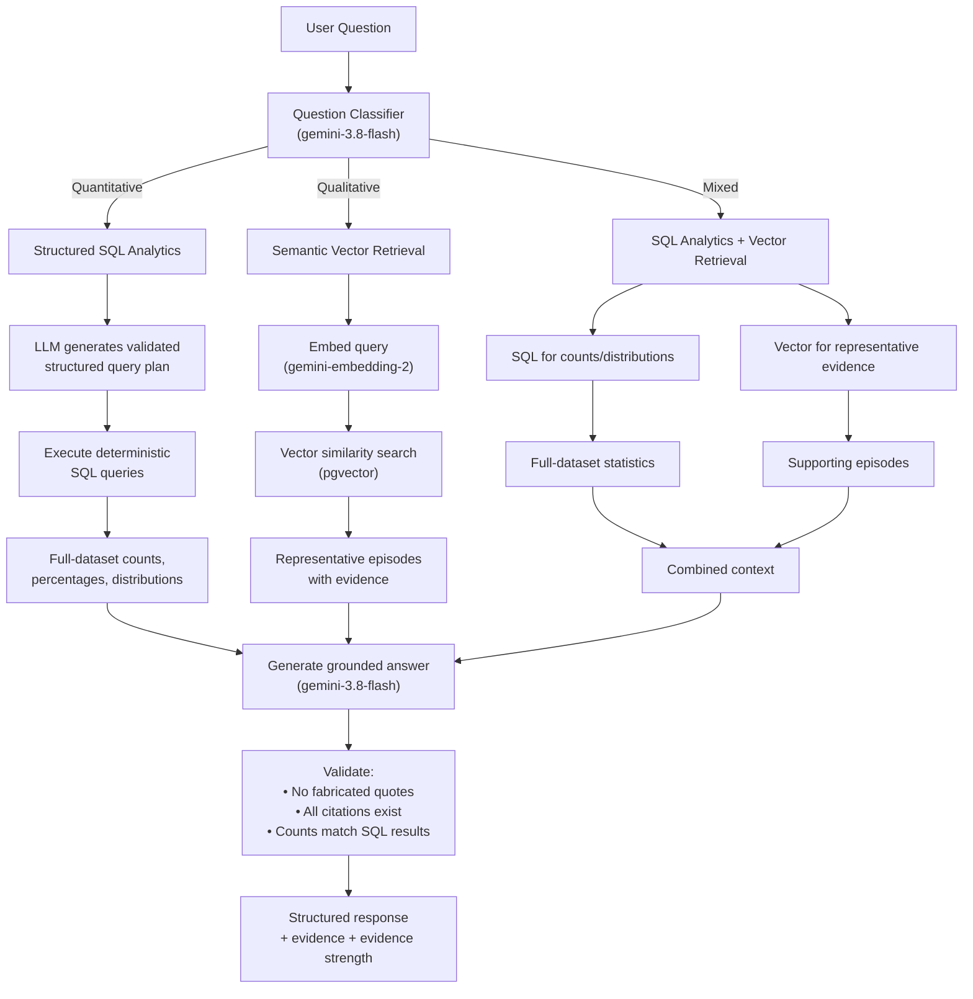
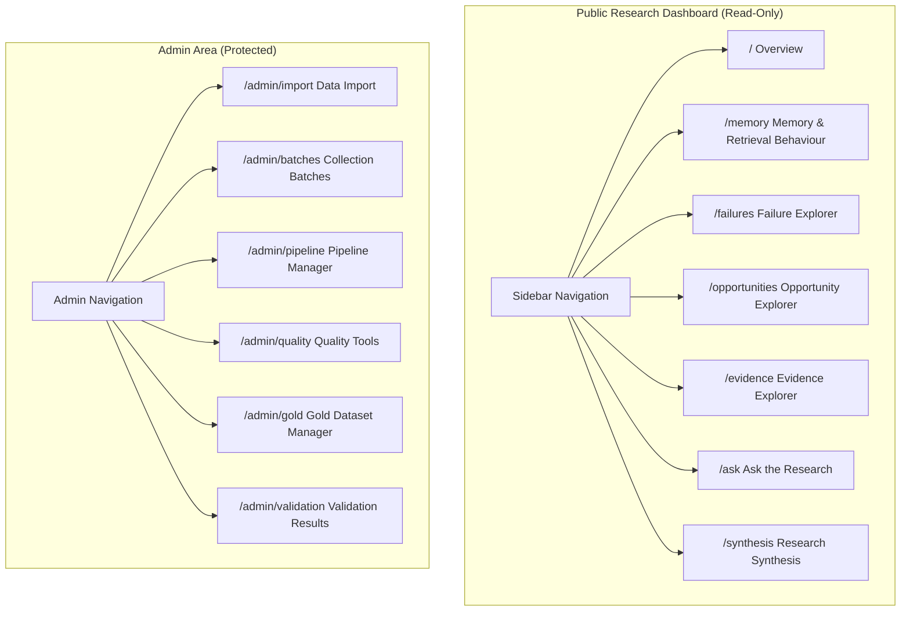
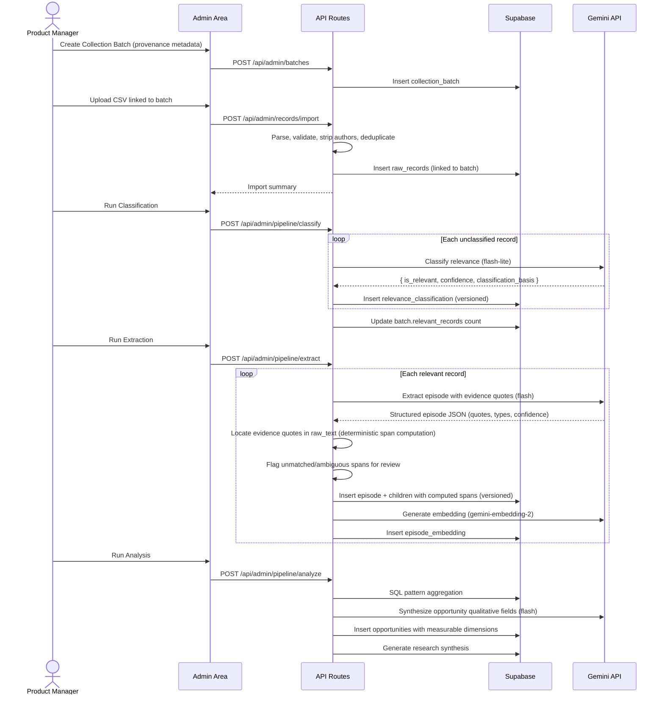
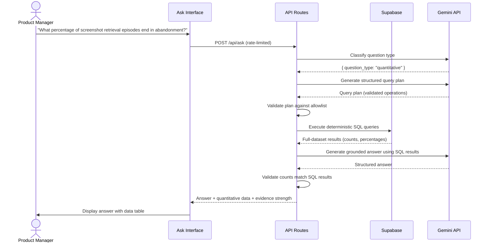
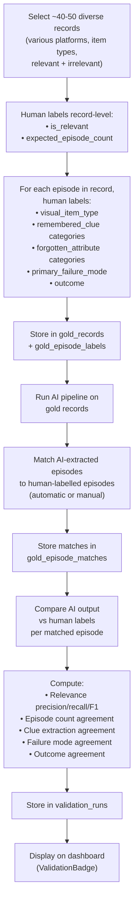
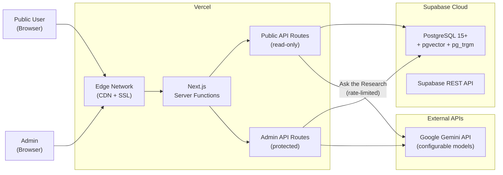

# Architecture — Google Photos AI-Powered Discovery Engine

> **Document Version:** 2.1 (FINAL)  
> **Last Updated:** 2026-09-24  
> **Status:** Design Phase — Final  

---

## Table of Contents

1. [System Overview](#1-system-overview)
2. [Architecture Principles](#2-architecture-principles)
3. [Technology Stack](#3-technology-stack)
4. [High-Level Architecture](#4-high-level-architecture)
5. [Data Architecture](#5-data-architecture)
6. [AI Processing Pipeline](#6-ai-processing-pipeline)
7. [Hybrid Research Query Engine](#7-hybrid-research-query-engine)
8. [Backend API Architecture](#8-backend-api-architecture)
9. [Frontend / Dashboard Architecture](#9-frontend--dashboard-architecture)
10. [Prompt & Agent Architecture](#10-prompt--agent-architecture)
11. [Pattern Discovery & Opportunity Engine](#11-pattern-discovery--opportunity-engine)
12. [Gold Dataset Validation](#12-gold-dataset-validation)
13. [Research Limitations](#13-research-limitations)
14. [Security Architecture](#14-security-architecture)
15. [Deployment Architecture](#15-deployment-architecture)
16. [Error Handling & Resilience](#16-error-handling--resilience)
17. [Performance Considerations](#17-performance-considerations)
18. [Testing Strategy](#18-testing-strategy)
19. [Monitoring & Observability](#19-monitoring--observability)

---

## 1. System Overview

### 1.1 Purpose

The Discovery Engine is an internal **research tool** for Product Managers and Product Researchers. It ingests publicly available user feedback about photo/visual-item retrieval, processes it through an AI pipeline, and surfaces structured behavioral evidence through an interactive research dashboard with a **hybrid research query interface** combining deterministic analytics with semantic retrieval.

### 1.2 What This System Is NOT

- ❌ A production Google Photos feature
- ❌ A general-purpose sentiment analysis tool
- ❌ A customer support tool
- ❌ A photo search engine

### 1.3 Core Capabilities



---

## 2. Architecture Principles

| # | Principle | Rationale |
|---|-----------|-----------|
| 1 | **Simplicity First** | Architecture must be explainable on one presentation slide |
| 2 | **Evidence Traceability** | Every insight must trace back to raw source data with exact character-span evidence |
| 3 | **Three-Layer Data Integrity** | Raw → Structured → Insights; never overwrite raw data |
| 4 | **Observation vs Inference** | Clearly separate observed evidence, AI interpretation, and hypotheses |
| 5 | **No Data Fabrication** | Never invent quotes, links, counts, or behaviors |
| 6 | **Grounded AI Responses** | All AI outputs must be anchored in the actual dataset |
| 7 | **Incremental Processing** | Pipeline stages are independent and re-runnable |
| 8 | **Collection Provenance** | Every record must be traceable to a collection batch with transparent sampling methodology |
| 9 | **No Private Chain-of-Thought** | AI-generated records store short evidence-grounded rationale only, not internal reasoning chains |
| 10 | **Measurable Over Arbitrary** | Opportunity comparison uses measurable dimensions, not LLM-assigned scores |
| 11 | **PII Minimization** | Do not require or publicly display author usernames |
| 12 | **Pipeline Validation** | AI pipeline accuracy is measured against a gold dataset before relying on its insights |

---

## 3. Technology Stack

### 3.1 Stack Selection Rationale

The stack is chosen to minimize operational complexity while maximizing AI integration quality and deployment simplicity.

### 3.2 Chosen Stack

| Layer | Technology | Purpose |
|-------|-----------|---------|
| **Framework** | Next.js 14+ (App Router) | Full-stack React framework with SSR, API routes, server actions |
| **Language** | TypeScript 5.x | Type safety across frontend and backend |
| **UI Components** | Shadcn/ui | Accessible, composable component primitives |
| **Styling** | Tailwind CSS 3.x | Utility-first CSS for rapid UI development |
| **Charts** | Recharts | Data visualization — bar charts, pie charts, heatmaps |
| **Database** | Supabase (PostgreSQL 15+) | Managed PostgreSQL with real-time, auth, and APIs |
| **Vector Store** | pgvector 0.7+ | Vector similarity search co-located with relational data |
| **AI — Classification** | Configurable (default: `gemini-3.5-flash-lite`) | Relevance classification, high-volume lightweight tasks |
| **AI — Extraction/Synthesis** | Configurable (default: `gemini-3.8-flash`) | Episode extraction, opportunity synthesis, query engine responses |
| **AI — Embeddings** | Configurable (default: `gemini-embedding-2`) | 768-dimensional semantic search embeddings |
| **Deployment** | Vercel | Zero-config Next.js deployment with edge functions |
| **DB Hosting** | Supabase Cloud | Managed PostgreSQL + pgvector |

### 3.3 AI Model Configuration

All model identifiers are **configurable through environment variables**, not hardcoded.

```bash
# AI Model Configuration (env vars)
GEMINI_MODEL_CLASSIFICATION=gemini-3.5-flash-lite
GEMINI_MODEL_EXTRACTION=gemini-3.8-flash
GEMINI_MODEL_SYNTHESIS=gemini-3.8-flash
GEMINI_MODEL_EMBEDDING=gemini-embedding-2
GEMINI_EMBEDDING_DIMENSIONS=768
```

| Task | Default Model | Rationale |
|------|--------------|-----------|
| Relevance classification | `gemini-3.5-flash-lite` | High-volume, lightweight — cost-efficient for binary classification |
| Episode extraction | `gemini-3.8-flash` | Complex structured extraction requiring reasoning |
| Opportunity synthesis | `gemini-3.8-flash` | Nuanced aggregation and root-cause analysis |
| Query engine responses | `gemini-3.8-flash` | Grounded answer generation with citation |
| Embeddings | `gemini-embedding-2` | 768-dim vectors; strong semantic quality |

### 3.4 Why This Stack

| Decision | Reasoning |
|----------|-----------|
| **Next.js** over separate frontend/backend | Single codebase, shared types, server components reduce client bundle, API routes co-located |
| **Supabase** over raw PostgreSQL | Managed hosting, REST/GraphQL APIs, pgvector support, generous free tier |
| **pgvector** over Pinecone/Weaviate | Co-located with relational data — avoids syncing two databases; simpler architecture |
| **Gemini** over OpenAI/Claude | Google ecosystem alignment; strong structured-output support; cost-effective for batch processing |
| **Vercel** over AWS/GCP | Optimized for Next.js; zero-config deployment; automatic HTTPS; preview deployments |
| **Recharts only** (no Nivo/D3) | Sufficient for the chart types needed; smaller bundle; simpler API |

---

## 4. High-Level Architecture

### 4.1 System Architecture Diagram



### 4.2 One-Slide Architecture Summary

```
┌──────────────────────────────────────────────────────────────────┐
│                      DISCOVERY ENGINE v2                          │
│                                                                   │
│  CSV/JSON  ──▶  Collection  ──▶  Clean   ──▶  Classify           │
│  Import        Batch             & Dedup      Relevance           │
│                (provenance)                   (flash-lite)         │
│                                                                   │
│  ──▶  Extract Episodes  ──▶  Embed (gemini-embedding-2)          │
│       (flash, char-span        768-dim pgvector                   │
│        evidence)                                                  │
│                                                                   │
│  ┌────────────────────────────────────────────────────┐           │
│  │   PostgreSQL + pgvector                            │           │
│  │   Layer 1: Raw Data + Collection Batches           │           │
│  │   Layer 2: Structured Episodes + Evidence Spans    │           │
│  │   Layer 3: Insights + Measurable Opportunities     │           │
│  └────────────────────────────────────────────────────┘           │
│                        │                                          │
│        ┌───────────────┴───────────────┐                          │
│        ▼                               ▼                          │
│  Research Dashboard              Hybrid Query Engine               │
│  (Public, Read-Only)             SQL (quantitative)                │
│  6 Explorer Views                Vector (qualitative)              │
│  + Research Synthesis            Combined (mixed)                  │
│                                                                   │
│  Admin Area (Protected): Import · Pipeline · Quality · Gold       │
│                                                                   │
│  Stack: Next.js · Supabase · Gemini (configurable) · Vercel      │
│  Validation: Gold dataset (40–50 records) · Precision/Recall/F1  │
└──────────────────────────────────────────────────────────────────┘
```

---

## 5. Data Architecture

### 5.1 Three-Layer Data Model



### 5.2 Collection Provenance

#### Table: `collection_batches`

| Column | Type | Constraints | Description |
|--------|------|-------------|-------------|
| `id` | `UUID` | PK, default `gen_random_uuid()` | Batch identifier |
| `platform` | `TEXT` | NOT NULL | Source platform (Reddit, Play Store, etc.) |
| `search_query` | `TEXT` | NULLABLE | Search query or criteria used to find these records |
| `collection_date` | `DATE` | NOT NULL | When collection was performed |
| `collection_method` | `TEXT` | NOT NULL | manual / csv_import / api_scrape |
| `language` | `TEXT` | NOT NULL, default `'en'` | Language of collected content |
| `date_range_start` | `DATE` | NULLABLE | Start of the date range for collected content |
| `date_range_end` | `DATE` | NULLABLE | End of the date range for collected content |
| `records_found` | `INTEGER` | NULLABLE | Total records found before filtering |
| `records_imported` | `INTEGER` | NOT NULL, default `0` | Records actually imported |
| `relevant_records` | `INTEGER` | NOT NULL, default `0` | Records classified as relevant (updated after classification) |
| `notes` | `TEXT` | NULLABLE | Free-text notes about collection methodology |
| `created_at` | `TIMESTAMPTZ` | NOT NULL, default `now()` | When batch was created |

> [!IMPORTANT]
> The collection provenance layer exists to make **sampling methodology transparent** and reduce cherry-picking risk. Every raw record must link to a collection batch.

### 5.3 Layer 1 — Raw Source Data

#### Table: `raw_records`

| Column | Type | Constraints | Description |
|--------|------|-------------|-------------|
| `id` | `UUID` | PK, default `gen_random_uuid()` | Unique record identifier |
| `batch_id` | `UUID` | FK → `collection_batches.id`, NOT NULL | Parent collection batch |
| `platform` | `TEXT` | NOT NULL | Source platform |
| `source_url` | `TEXT` | NULLABLE | Original URL of the content |
| `date_posted` | `TIMESTAMPTZ` | NULLABLE | When the content was originally posted |
| `title` | `TEXT` | NULLABLE | Title of the post/review |
| `raw_text` | `TEXT` | NOT NULL | Full raw text content |
| `thread_context` | `TEXT` | NULLABLE | Surrounding thread/conversation context |
| `imported_at` | `TIMESTAMPTZ` | NOT NULL, default `now()` | Timestamp of import |
| `is_duplicate` | `BOOLEAN` | default `false` | Flagged as duplicate |
| `duplicate_of` | `UUID` | FK → `raw_records.id`, NULLABLE | Reference to original if duplicate |
| `text_hash` | `TEXT` | NOT NULL | SHA-256 hash of normalized raw_text for dedup |
| `metadata` | `JSONB` | default `{}` | Extensible metadata |

> [!NOTE]
> The `author` field has been **removed**. Author usernames are not required for this research and are not stored or publicly displayed. Platform and source URL provide sufficient traceability.

#### Table: `relevance_classifications`

| Column | Type | Constraints | Description |
|--------|------|-------------|-------------|
| `id` | `UUID` | PK | Classification identifier |
| `record_id` | `UUID` | FK → `raw_records.id`, UNIQUE | Associated raw record |
| `is_relevant` | `BOOLEAN` | NOT NULL | Relevance determination |
| `confidence` | `DECIMAL(3,2)` | NOT NULL, CHECK 0–1 | Classification confidence |
| `classification_basis` | `TEXT` | NOT NULL | Short evidence-grounded explanation of why relevant/irrelevant |
| `retrieval_target` | `TEXT` | NULLABLE | What user was trying to find |
| `evidence_of_vague_memory` | `TEXT` | NULLABLE | Evidence of incomplete memory |
| `classified_at` | `TIMESTAMPTZ` | NOT NULL, default `now()` | When classification occurred |
| `model_version` | `TEXT` | NOT NULL | AI model identifier used |
| `prompt_version` | `TEXT` | NOT NULL | Prompt template version |
| `schema_version` | `TEXT` | NOT NULL | Output schema version |

### 5.4 Layer 2 — Structured Retrieval Episodes

#### Table: `retrieval_episodes`

| Column | Type | Constraints | Description |
|--------|------|-------------|-------------|
| `id` | `UUID` | PK | Episode identifier |
| `record_id` | `UUID` | FK → `raw_records.id` | Source raw record |
| `visual_item_type` | `TEXT` | NOT NULL | photo, screenshot, receipt, etc. |
| `retrieval_goal` | `TEXT` | NOT NULL | What the user was trying to find |
| `why_user_needs_item` | `TEXT` | NULLABLE | Purpose/motivation for retrieval |
| `outcome` | `TEXT` | NOT NULL | success / partial_success / failure / abandoned / unknown |
| `impact_type` | `TEXT` | NULLABLE | functional / emotional |
| `urgency` | `TEXT` | NULLABLE | Urgency level if supported |
| `frustration_level` | `TEXT` | NULLABLE | low / moderate / high / extreme |
| `consequence` | `TEXT` | NULLABLE | Consequence of failed retrieval |
| `rationale_summary` | `TEXT` | NOT NULL | Short evidence-grounded explanation of extraction decisions |
| `extraction_confidence` | `DECIMAL(3,2)` | NOT NULL | Confidence in extraction quality |
| `model_version` | `TEXT` | NOT NULL | AI model identifier |
| `prompt_version` | `TEXT` | NOT NULL | Prompt template version |
| `schema_version` | `TEXT` | NOT NULL | Output schema version |
| `extracted_at` | `TIMESTAMPTZ` | NOT NULL, default `now()` | When extraction occurred |

#### Table: `remembered_clues`

| Column | Type | Constraints | Description |
|--------|------|-------------|-------------|
| `id` | `UUID` | PK | Clue identifier |
| `episode_id` | `UUID` | FK → `retrieval_episodes.id` | Parent episode |
| `clue_category` | `TEXT` | NOT NULL | Category from memory-clue taxonomy |
| `clue_description` | `TEXT` | NOT NULL | What the user remembers |
| `evidence_quote` | `TEXT` | NOT NULL | Exact quote from the source text (returned by LLM) |
| `source_record_id` | `UUID` | FK → `raw_records.id`, NOT NULL | Source record containing the quote |
| `char_start` | `INTEGER` | NULLABLE | Start character position — computed by application code, not LLM |
| `char_end` | `INTEGER` | NULLABLE | End character position — computed by application code, not LLM |
| `span_status` | `TEXT` | NOT NULL, default `'pending'` | matched / ambiguous / not_found / pending |
| `evidence_type` | `TEXT` | NOT NULL | observed / interpreted / hypothesized |
| `confidence` | `DECIMAL(3,2)` | NOT NULL | AI extraction confidence for this clue |

#### Table: `forgotten_attributes`

| Column | Type | Constraints | Description |
|--------|------|-------------|-------------|
| `id` | `UUID` | PK | Attribute identifier |
| `episode_id` | `UUID` | FK → `retrieval_episodes.id` | Parent episode |
| `attribute_category` | `TEXT` | NOT NULL | Category from forgotten-info taxonomy |
| `description` | `TEXT` | NOT NULL | What was forgotten |
| `evidence_quote` | `TEXT` | NOT NULL | Exact quote from source text (returned by LLM) |
| `source_record_id` | `UUID` | FK → `raw_records.id`, NOT NULL | Source record |
| `char_start` | `INTEGER` | NULLABLE | Start char position — computed by application code |
| `char_end` | `INTEGER` | NULLABLE | End char position — computed by application code |
| `span_status` | `TEXT` | NOT NULL, default `'pending'` | matched / ambiguous / not_found / pending |
| `evidence_type` | `TEXT` | NOT NULL | observed / interpreted / hypothesized |
| `confidence` | `DECIMAL(3,2)` | NOT NULL | AI extraction confidence |

#### Table: `search_behaviors`

| Column | Type | Constraints | Description |
|--------|------|-------------|-------------|
| `id` | `UUID` | PK | Behavior identifier |
| `episode_id` | `UUID` | FK → `retrieval_episodes.id` | Parent episode |
| `behavior_type` | `TEXT` | NOT NULL | initial_query / subsequent_query / filter / browse / scroll / strategy_change |
| `description` | `TEXT` | NOT NULL | What the user did |
| `sequence_order` | `INTEGER` | NULLABLE | Order in the retrieval attempt |
| `evidence_quote` | `TEXT` | NOT NULL | Exact supporting quote (returned by LLM) |
| `source_record_id` | `UUID` | FK → `raw_records.id`, NOT NULL | Source record |
| `char_start` | `INTEGER` | NULLABLE | Start char position — computed by application code |
| `char_end` | `INTEGER` | NULLABLE | End char position — computed by application code |
| `span_status` | `TEXT` | NOT NULL, default `'pending'` | matched / ambiguous / not_found / pending |

#### Table: `failure_modes`

| Column | Type | Constraints | Description |
|--------|------|-------------|-------------|
| `id` | `UUID` | PK | Failure identifier |
| `episode_id` | `UUID` | FK → `retrieval_episodes.id` | Parent episode |
| `failure_type` | `TEXT` | NOT NULL | expression / interpretation / candidate_retrieval / recognition / refinement / other |
| `failure_priority` | `TEXT` | NOT NULL | earliest / primary / secondary |
| `description` | `TEXT` | NOT NULL | Description of the failure |
| `evidence_quote` | `TEXT` | NOT NULL | Exact supporting quote (returned by LLM) |
| `source_record_id` | `UUID` | FK → `raw_records.id`, NOT NULL | Source record |
| `char_start` | `INTEGER` | NULLABLE | Start char position — computed by application code |
| `char_end` | `INTEGER` | NULLABLE | End char position — computed by application code |
| `span_status` | `TEXT` | NOT NULL, default `'pending'` | matched / ambiguous / not_found / pending |
| `rationale_summary` | `TEXT` | NOT NULL | Short evidence-grounded explanation for classification |
| `confidence` | `DECIMAL(3,2)` | NOT NULL | AI extraction confidence |

#### Table: `workarounds`

| Column | Type | Constraints | Description |
|--------|------|-------------|-------------|
| `id` | `UUID` | PK | Workaround identifier |
| `episode_id` | `UUID` | FK → `retrieval_episodes.id` | Parent episode |
| `workaround_type` | `TEXT` | NOT NULL | manual_scroll / browse_by_date / browse_by_person / browse_by_location / check_albums / search_other_app / check_messages / ask_person / search_cloud_folders / google_search / give_up / other |
| `description` | `TEXT` | NOT NULL | What the user did as workaround |
| `evidence_quote` | `TEXT` | NOT NULL | Exact supporting quote (returned by LLM) |
| `source_record_id` | `UUID` | FK → `raw_records.id`, NOT NULL | Source record |
| `char_start` | `INTEGER` | NULLABLE | Start char position — computed by application code |
| `char_end` | `INTEGER` | NULLABLE | End char position — computed by application code |
| `span_status` | `TEXT` | NOT NULL, default `'pending'` | matched / ambiguous / not_found / pending |
| `led_to_success` | `BOOLEAN` | NULLABLE | Whether workaround succeeded |

> [!IMPORTANT]
> **Evidence Span Generation:** The LLM returns `evidence_quote`, `evidence_type`, and `confidence` only. It does **not** generate `char_start`/`char_end`. After receiving the structured AI output, **application code** locates the exact `evidence_quote` inside `raw_text` and deterministically computes `char_start` and `char_end`. If the quote cannot be found, differs from the source text, or has multiple ambiguous occurrences, the `span_status` is set accordingly and the evidence span is flagged for manual review.

### 5.5 Layer 3 — Opportunities & Insights

#### Table: `opportunities`

| Column | Type | Constraints | Description |
|--------|------|-------------|-------------|
| `id` | `UUID` | PK | Opportunity identifier |
| `title` | `TEXT` | NOT NULL | Short opportunity title |
| `retrieval_scenario` | `TEXT` | NOT NULL | Description of the retrieval scenario |
| `target_type` | `TEXT` | NULLABLE | Visual item type or user behavior |
| `remembered_info_summary` | `TEXT` | NOT NULL | What users typically remember |
| `forgotten_info_summary` | `TEXT` | NOT NULL | What users typically forget |
| `failure_stage` | `TEXT` | NOT NULL | Where failure typically occurs |
| `observed_behavior` | `TEXT` | NOT NULL | What users do |
| `current_workaround` | `TEXT` | NULLABLE | How users work around the problem |
| `typical_outcome` | `TEXT` | NOT NULL | What usually happens |
| **Measurable Dimensions** | | | |
| `supporting_episode_count` | `INTEGER` | NOT NULL | COUNT(DISTINCT episode_id) supporting this opportunity |
| `total_relevant_episodes` | `INTEGER` | NOT NULL | COUNT(DISTINCT id) from all retrieval_episodes (denominator) |
| `dataset_percentage` | `DECIMAL(5,2)` | NOT NULL | supporting_episode_count / total_relevant_episodes × 100 |
| `source_diversity` | `INTEGER` | NOT NULL | COUNT(DISTINCT platform) across supporting episodes |
| `failure_rate` | `DECIMAL(5,2)` | NULLABLE | See metric definitions below |
| `failure_rate_denominator` | `INTEGER` | NULLABLE | Episodes with known outcome (excl. 'unknown') |
| `abandonment_rate` | `DECIMAL(5,2)` | NULLABLE | See metric definitions below |
| `abandonment_rate_denominator` | `INTEGER` | NULLABLE | Episodes with known outcome (excl. 'unknown') |
| `multi_attempt_rate` | `DECIMAL(5,2)` | NULLABLE | See metric definitions below |
| `multi_attempt_denominator` | `INTEGER` | NULLABLE | Episodes with known retrieval-attempt behaviour |
| `workaround_rate` | `DECIMAL(5,2)` | NULLABLE | See metric definitions below |
| `manual_scroll_rate` | `DECIMAL(5,2)` | NULLABLE | See metric definitions below |
| `unknown_outcome_count` | `INTEGER` | NULLABLE | Episodes with outcome = 'unknown' |
| `evidence_strength` | `TEXT` | NOT NULL | strong / moderate / weak (multi-factor — see Section 11.3) |
| **Qualitative Fields** | | | |
| `observed_consequence` | `TEXT` | NULLABLE | What actually happened to users |
| `root_cause_hypothesis` | `TEXT` | NOT NULL | Deepest explanation from evidence |
| `alternative_explanations` | `TEXT` | NULLABLE | Other plausible causes |
| `potential_ai_leverage` | `TEXT` | NULLABLE | How AI could help |
| `uncertainty` | `TEXT` | NULLABLE | What remains uncertain |
| `generated_at` | `TIMESTAMPTZ` | NOT NULL, default `now()` | When generated |
| `model_version` | `TEXT` | NOT NULL | AI model used |
| `prompt_version` | `TEXT` | NOT NULL | Prompt version |
| `schema_version` | `TEXT` | NOT NULL | Schema version |

> [!IMPORTANT]
> The Opportunity Explorer does **not** assign an overall "opportunity score." Instead it presents measurable dimensions **side by side** so the Product Manager can apply their own judgment. The LLM synthesizes qualitative fields; all measurable dimensions are computed from SQL aggregation of episode data.

#### Metric Definitions

All episode-level metrics use `COUNT(DISTINCT episode_id)`. Never use clue-row counts or record counts as substitutes for episode counts.

| Metric | Formula | Numerator | Denominator |
|--------|---------|-----------|-------------|
| `dataset_percentage` | N / D × 100 | DISTINCT supporting episodes | All DISTINCT relevant retrieval episodes |
| `failure_rate` | N / D × 100 | Supporting episodes with `outcome = 'failure'` | Supporting episodes with known outcome (`outcome ≠ 'unknown'`) |
| `abandonment_rate` | N / D × 100 | Supporting episodes with `outcome = 'abandoned'` | Supporting episodes with known outcome (`outcome ≠ 'unknown'`) |
| `multi_attempt_rate` | N / D × 100 | Supporting episodes with ≥2 search_behaviors of type `initial_query` or `subsequent_query` | Supporting episodes where retrieval-attempt behaviour is known (≥1 search_behavior exists) |
| `workaround_rate` | N / D × 100 | Supporting episodes with ≥1 workaround record | All supporting episodes |
| `manual_scroll_rate` | N / D × 100 | Supporting episodes with workaround_type = `'manual_scroll'` | All supporting episodes |

> [!IMPORTANT]
> **Denominator transparency:** For percentages where missing/unknown data materially affects interpretation, the system stores and displays the **numerator**, **denominator**, and **unknown count** alongside the percentage. This prevents misleading statistics when many episodes have unknown outcomes.

> [!WARNING]
> **Counting discipline:** Clearly distinguish between:
> - **Clue rows** — number of extracted clue records (one episode may have many)
> - **Record count** — number of raw_records
> - **Episode count** — number of DISTINCT retrieval_episodes (the correct unit for behavioural metrics)
>
> Episode-level metrics must always aggregate at the episode level using `COUNT(DISTINCT episode_id)`.

#### Table: `opportunity_evidence`

| Column | Type | Constraints | Description |
|--------|------|-------------|-------------|
| `id` | `UUID` | PK | Link identifier |
| `opportunity_id` | `UUID` | FK → `opportunities.id` | Parent opportunity |
| `episode_id` | `UUID` | FK → `retrieval_episodes.id` | Supporting episode |
| `relevance_note` | `TEXT` | NULLABLE | Why this episode supports the opportunity |

#### Table: `insights`

| Column | Type | Constraints | Description |
|--------|------|-------------|-------------|
| `id` | `UUID` | PK | Insight identifier |
| `insight_statement` | `TEXT` | NOT NULL | The finding |
| `insight_type` | `TEXT` | NOT NULL | what_we_know / what_we_think / what_to_validate |
| `supporting_episode_count` | `INTEGER` | NOT NULL | COUNT(DISTINCT episode_id) |
| `dataset_percentage` | `DECIMAL(5,2)` | NULLABLE | % of relevant dataset |
| `source_diversity` | `INTEGER` | NOT NULL | COUNT(DISTINCT platform) |
| `representative_snippets` | `JSONB` | NOT NULL | Array of `{ quote, record_id, source_url, platform }` |
| `contradictory_evidence` | `TEXT` | NULLABLE | Any contradictory findings |
| `evidence_strength` | `TEXT` | NOT NULL | strong / moderate / weak (multi-factor — see Section 11.3) |
| `research_limitation` | `TEXT` | NULLABLE | Known limitations |
| `generated_at` | `TIMESTAMPTZ` | NOT NULL, default `now()` | When generated |
| `model_version` | `TEXT` | NOT NULL | AI model used |
| `prompt_version` | `TEXT` | NOT NULL | Prompt version |

### 5.6 Vector Store

#### Table: `episode_embeddings`

| Column | Type | Constraints | Description |
|--------|------|-------------|-------------|
| `id` | `UUID` | PK | Embedding identifier |
| `episode_id` | `UUID` | FK → `retrieval_episodes.id`, UNIQUE | Associated episode |
| `embedding_text` | `TEXT` | NOT NULL | Text that was embedded |
| `embedding` | `VECTOR(768)` | NOT NULL | 768-dim embedding vector |
| `model_version` | `TEXT` | NOT NULL | Embedding model used |
| `created_at` | `TIMESTAMPTZ` | NOT NULL, default `now()` | When created |

**Index:** `CREATE INDEX ON episode_embeddings USING ivfflat (embedding vector_cosine_ops) WITH (lists = 100);`

### 5.7 Gold Dataset & Validation

The gold dataset supports **multiple retrieval episodes per raw record**, matching the production extractor's behaviour. Labelling is split into record-level relevance and episode-level structured labels.

#### Table: `gold_records`

| Column | Type | Constraints | Description |
|--------|------|-------------|-------------|
| `id` | `UUID` | PK | Gold record identifier |
| `record_id` | `UUID` | FK → `raw_records.id`, UNIQUE | Labelled raw record |
| `is_relevant` | `BOOLEAN` | NOT NULL | Human relevance judgment |
| `dataset_split` | `TEXT` | NOT NULL, default `'development'` | development (calibration/tuning) / holdout (unseen validation) |
| `expected_episode_count` | `INTEGER` | NOT NULL, default `1` | Number of retrieval episodes the human identified |
| `labeller_notes` | `TEXT` | NULLABLE | Record-level annotator notes |
| `labelled_at` | `TIMESTAMPTZ` | NOT NULL, default `now()` | When labelled |

#### Table: `gold_episode_labels`

| Column | Type | Constraints | Description |
|--------|------|-------------|-------------|
| `id` | `UUID` | PK | Episode label identifier |
| `gold_record_id` | `UUID` | FK → `gold_records.id`, NOT NULL | Parent gold record |
| `episode_index` | `INTEGER` | NOT NULL | Human episode index within this record (1, 2, 3…) |
| `episode_description` | `TEXT` | NOT NULL | Brief human description of this retrieval episode |
| `visual_item_type` | `TEXT` | NOT NULL | Human-assigned item type |
| `remembered_clues` | `JSONB` | NOT NULL | Human-identified clue categories (array of strings) |
| `forgotten_attributes` | `JSONB` | NOT NULL | Human-identified forgotten categories (array of strings) |
| `primary_failure_mode` | `TEXT` | NULLABLE | Human-assigned failure mode |
| `outcome` | `TEXT` | NULLABLE | Human-assigned outcome |
| `notes` | `TEXT` | NULLABLE | Episode-level annotator notes |

#### Table: `gold_episode_matches`

| Column | Type | Constraints | Description |
|--------|------|-------------|-------------|
| `id` | `UUID` | PK | Match identifier |
| `validation_run_id` | `UUID` | FK → `validation_runs.id`, NOT NULL | Parent validation run |
| `gold_episode_id` | `UUID` | FK → `gold_episode_labels.id`, NOT NULL | Human-labelled episode |
| `ai_episode_id` | `UUID` | FK → `retrieval_episodes.id`, NULLABLE | Matched AI-extracted episode (null if no match) |
| `match_method` | `TEXT` | NOT NULL | automatic / manual | How the match was determined |
| `match_confidence` | `TEXT` | NULLABLE | high / medium / low (for automatic matches) |

> [!NOTE]
> If episode matching cannot be confidently performed automatically (e.g., the AI extracted a different number of episodes than the human labelled), the system supports **manual matching** during gold-dataset validation.

#### Table: `validation_runs`

| Column | Type | Constraints | Description |
|--------|------|-------------|-------------|
| `id` | `UUID` | PK | Run identifier |
| `run_date` | `TIMESTAMPTZ` | NOT NULL, default `now()` | When validation was run |
| `gold_record_count` | `INTEGER` | NOT NULL | Number of gold records evaluated |
| `gold_episode_count` | `INTEGER` | NOT NULL | Number of gold episode labels evaluated |
| `relevance_precision` | `DECIMAL(5,4)` | NOT NULL | Precision for relevance classification |
| `relevance_recall` | `DECIMAL(5,4)` | NOT NULL | Recall for relevance classification |
| `relevance_f1` | `DECIMAL(5,4)` | NOT NULL | F1 score for relevance |
| `episode_count_agreement` | `DECIMAL(5,4)` | NULLABLE | Agreement on number of episodes per record |
| `clue_extraction_agreement` | `DECIMAL(5,4)` | NULLABLE | Jaccard similarity on remembered-clue categories |
| `failure_mode_agreement` | `DECIMAL(5,4)` | NULLABLE | Exact match on primary failure mode |
| `outcome_agreement` | `DECIMAL(5,4)` | NULLABLE | Exact match on retrieval outcome |
| `model_version` | `TEXT` | NOT NULL | Model evaluated |
| `prompt_version` | `TEXT` | NOT NULL | Prompt version evaluated |
| `schema_version` | `TEXT` | NOT NULL | Schema version evaluated |
| `details` | `JSONB` | NOT NULL | Per-record/episode results, confusion matrices, match details |
| `notes` | `TEXT` | NULLABLE | Notes about this run |

### 5.8 Quality & Usage Tracking

#### Table: `quality_flags`

| Column | Type | Constraints | Description |
|--------|------|-------------|-------------|
| `id` | `UUID` | PK | Flag identifier |
| `target_type` | `TEXT` | NOT NULL | record / episode / insight / opportunity |
| `target_id` | `UUID` | NOT NULL | ID of the flagged item |
| `flag_type` | `TEXT` | NOT NULL | duplicate / unsupported_claim / small_sample / irrelevant_included / sentiment_as_severity / frequency_as_importance / hypothesis_as_fact / source_overrepresentation / broken_url / overlapping_category / premature_solution_bias |
| `description` | `TEXT` | NOT NULL | Description of the quality issue |
| `resolved` | `BOOLEAN` | default `false` | Whether the issue was resolved |
| `created_at` | `TIMESTAMPTZ` | NOT NULL, default `now()` | When flagged |

#### Table: `ai_usage_log`

| Column | Type | Constraints | Description |
|--------|------|-------------|-------------|
| `id` | `UUID` | PK | Log entry identifier |
| `operation` | `TEXT` | NOT NULL | classify / extract / embed / query_engine |
| `model` | `TEXT` | NOT NULL | Model used |
| `input_tokens` | `INTEGER` | NULLABLE | Tokens in prompt |
| `output_tokens` | `INTEGER` | NULLABLE | Tokens in response |
| `cost_estimate` | `DECIMAL(10,6)` | NULLABLE | Estimated cost in USD |
| `duration_ms` | `INTEGER` | NULLABLE | API call duration |
| `record_id` | `UUID` | NULLABLE | Associated record/episode |
| `created_at` | `TIMESTAMPTZ` | NOT NULL, default `now()` | Timestamp |

---

## 6. AI Processing Pipeline

### 6.1 Pipeline Overview

```mermaid
flowchart LR
    subgraph stage1["Stage 1: Ingest"]
        UPLOAD["Upload CSV/JSON"]
        BATCH_CREATE["Create Collection Batch"]
        PARSE["Parse & Validate"]
        DEDUP["Deduplicate"]
    end

    subgraph stage2["Stage 2: Classify"]
        RELEVANCE["Relevance Classifier\n(gemini-3.5-flash-lite)"]
    end

    subgraph stage3["Stage 3: Extract"]
        EPISODE["Episode Extractor\n(gemini-3.8-flash)\n→ returns evidence_quote"]
        SPAN["Span Locator\n(application code)\n→ computes char_start/end"]
        EMBED_GEN["Generate Embeddings\n(gemini-embedding-2)"]
    end

    subgraph stage4["Stage 4: Analyze"]
        PATTERN["Pattern Aggregation\n(SQL)"]
        OPP_GEN["Opportunity Generation\n(SQL dimensions + LLM qualitative)"]
        QUALITY_CHECK["Quality Checks"]
    end

    stage1 --> stage2 --> stage3 --> stage4
```



### 6.2 Stage 1 — Data Ingestion & Cleaning

**Input:** CSV or JSON file upload via the admin dashboard.

**Processing Steps:**

1. **Create Collection Batch**
   - PM fills in provenance metadata: platform, search query, collection method, language, date range, notes
   - Batch record created before any records are imported

2. **Parse & Validate**
   - Validate required fields (`raw_text`, `platform`)
   - Normalize platform names
   - Parse dates into ISO 8601 format
   - Strip author/username fields — do not store
   - Trim whitespace, normalize Unicode

3. **Deduplication**
   - **Exact match:** SHA-256 hash of normalized `raw_text` → stored in `text_hash`
   - **Near-duplicate:** Trigram similarity using `pg_trgm` extension
     - Threshold: `similarity(a, b) > 0.85` → flag as potential duplicate
   - **Cross-post detection:** Similar text across different `platform` values within any batch
   - Duplicates are **flagged, not deleted** — raw data is never destroyed

4. **Output:** Records inserted into `raw_records` linked to `collection_batches`; batch counts updated

### 6.3 Stage 2 — Relevance Classification

**Input:** Each `raw_record` not yet classified.

**Model:** Configurable, default `gemini-3.5-flash-lite`

**Prompt Strategy:**

```
SYSTEM PROMPT (Summary):
You are a relevance classifier for a research project studying how users 
retrieve vaguely remembered visual items from photo libraries.

A record is RELEVANT when it contains evidence of a user trying to find 
a specific visual item that they remember incompletely.

A record is IRRELEVANT when it discusses: backup/sync issues, storage 
complaints, editing, sharing, account access, upload failures, duplicate 
management, generic performance complaints, casual browsing, or general 
search complaints without a specific vague-memory retrieval scenario.

OUTPUT (JSON):
{
  "is_relevant": boolean,
  "confidence": number (0-1),
  "classification_basis": "short evidence-grounded explanation",
  "retrieval_target": string | null,
  "evidence_of_vague_memory": string | null
}
```

**Batch Processing:** Records processed in batches of 10–20 to optimize API costs.

**Quality Gate:** Records with `confidence < 0.6` are flagged for manual review.

**Versioning:** Every classification stores `model_version`, `prompt_version`, and `schema_version`.

### 6.4 Stage 3 — Retrieval Episode Extraction

**Input:** Each relevant `raw_record`.

**Model:** Configurable, default `gemini-3.8-flash`

**Key Requirements:**

1. The LLM returns an **exact evidence quote**, **evidence type**, and **confidence** for every extracted field
2. The LLM does **NOT** return `char_start` or `char_end` — these are computed by application code after extraction
3. Evidence type must be classified as `observed`, `interpreted`, or `hypothesized`
4. The `rationale_summary` field stores a short evidence-grounded explanation — not internal chain-of-thought
5. A single raw record may produce multiple retrieval episodes

**Prompt Strategy:**

```
SYSTEM PROMPT (Summary):
You are a behavioral researcher extracting structured retrieval episodes 
from user conversations about finding vaguely remembered visual items.

CRITICAL RULES:
1. Only extract information directly supported by the text.
2. For EVERY extracted field, provide:
   - The exact quote from the source text (copy verbatim)
   - Evidence type: OBSERVED / INTERPRETED / HYPOTHESIZED
   - Confidence score (0-1)
3. Do NOT provide character positions — only the exact quote.
4. Never invent quotes, behaviors, or details not in the source text.
5. A single source may contain multiple retrieval episodes.
6. Store only a short evidence-grounded rationale_summary, 
   not your internal reasoning process.

TAXONOMIES PROVIDED:
- Memory Clue Categories: [full list]
- Forgotten Information Categories: [full list]
- Failure Mode Categories: [full list]
- Workaround Categories: [full list]
- Outcome Categories: [full list]

OUTPUT (JSON): [Full structured episode schema with evidence_quote per field]
```

**Post-Processing — Evidence Span Location:**

After receiving structured AI output, **application code** performs deterministic span location:

1. Validate JSON schema compliance (Zod)
2. For each `evidence_quote` in the AI output:
   a. Search for the exact quote string in the source `raw_text`
   b. If **exactly one match** is found → set `char_start`, `char_end`, `span_status = 'matched'`
   c. If **no match** is found → set `char_start = null`, `char_end = null`, `span_status = 'not_found'` → flag for review
   d. If **multiple ambiguous matches** are found → set first match positions, `span_status = 'ambiguous'` → flag for review
   e. If the quote **differs from source text** (e.g., minor LLM rephrasing) → attempt fuzzy matching; if best match similarity ≥ 0.90, use it with `span_status = 'matched'`; otherwise `span_status = 'not_found'` → flag for review
3. Store each episode and child records with computed spans
4. Generate embedding for the concatenated episode text

> [!CAUTION]
> **Do not trust LLM-generated character offsets.** LLMs are unreliable at counting characters. All span positions must be computed deterministically by application code.

**Embedding Generation:**
- **Input text:** Concatenation of `retrieval_goal` + `remembered_clues` + `forgotten_attributes` + `failure descriptions` + `raw_text` (truncated to model limit)
- **Model:** Configurable, default `gemini-embedding-2` (768 dimensions)
- **Storage:** `episode_embeddings` table with IVFFlat index

---

## 7. Hybrid Research Query Engine

### 7.1 Architecture Overview

The Ask-the-Research feature uses a **hybrid query engine** instead of pure vector-RAG. The engine classifies each user question and selects the appropriate retrieval strategy.



### 7.2 Question Classification

Every incoming question is classified into one of three types:

| Type | Signal | Strategy | Example |
|------|--------|----------|---------|
| **Quantitative** | Counts, percentages, distributions, comparisons, rankings | Full-dataset SQL analytics | *"How many episodes involve screenshot retrieval?"* |
| **Qualitative** | What, how, why, representative examples, narratives | Semantic vector retrieval | *"What do users remember when finding travel photos?"* |
| **Mixed** | Combines statistical questions with behavioral detail | SQL stats + vector evidence | *"Compare screenshot vs travel-photo retrieval failure rates and show examples."* |

**Classification Prompt Output:**

```json
{
  "question_type": "quantitative" | "qualitative" | "mixed",
  "quantitative_aspects": ["list of metrics/counts needed"],
  "qualitative_aspects": ["list of behavioral/narrative aspects needed"],
  "classification_basis": "short explanation"
}
```

### 7.3 Quantitative Path — Structured Query Plan

> [!IMPORTANT]
> Dataset-level counts, percentages, and distributions are **never** calculated from Top-K vector results. They are always computed from the **complete structured dataset** using deterministic SQL.

The LLM generates a **validated structured query plan** rather than unrestricted raw text-to-SQL.

**Query Plan Structure:**

```json
{
  "query_plan": [
    {
      "query_id": "q1",
      "description": "Count episodes by visual item type",
      "table": "retrieval_episodes",
      "operation": "count_group_by",
      "group_by": ["visual_item_type"],
      "filters": [],
      "joins": []
    },
    {
      "query_id": "q2",
      "description": "Failure rate for screenshot episodes",
      "table": "retrieval_episodes",
      "operation": "percentage",
      "numerator_filter": { "outcome": ["failure", "abandoned"] },
      "denominator_filter": { "visual_item_type": ["screenshot"] },
      "joins": ["failure_modes"]
    }
  ]
}
```

**Allowed Operations:**

| Operation | Description |
|-----------|-------------|
| `count` | Count records matching filters |
| `count_group_by` | Count grouped by one or more columns |
| `percentage` | Numerator/denominator percentage |
| `distribution` | Value distribution for a column |
| `cross_tabulation` | Two-dimensional cross-tab |
| `top_n` | Top N values by count |
| `comparison` | Side-by-side comparison of two filtered groups |

**Safety:** Query plans are validated against an allowlist of tables, columns, and operations before execution. No raw SQL from the LLM is executed directly.

### 7.4 Qualitative Path — Semantic Retrieval

| Parameter | Value | Rationale |
|-----------|-------|-----------|
| Embedding model | Configurable (`gemini-embedding-2`) | 768-dim, good semantic quality |
| Distance metric | Cosine similarity | Standard for text embeddings |
| Top-K retrieval | 15–20 | Enough for diverse evidence, within context limits |
| Similarity threshold | 0.65 | Filter low-relevance matches |
| Re-ranking | By relevance score + source diversity | Ensure cross-platform evidence |
| Context window | ~8,000 tokens of evidence | Leave room for system prompt + generation |

### 7.5 Answer Generation

**System Prompt Rules:**

```
You are a research assistant for a Google Photos product research project.
You answer questions ONLY using the provided evidence from real user conversations.

RULES:
1. Base every claim on the provided evidence.
2. For QUANTITATIVE claims: use only the SQL query results provided. 
   Never estimate counts from sample evidence.
3. For QUALITATIVE claims: cite specific episodes by episode_id and platform.
4. Quote users using their actual words from the evidence.
5. State the number of supporting episodes (from SQL counts, not sample size).
6. Mention contradictory evidence when it exists.
7. Rate evidence strength (NOT model confidence):
   - strong: 5+ supporting episodes, 3+ platforms, mostly directly observed
   - moderate: 3-4 supporting episodes, 2+ platforms
   - weak: 1-2 supporting episodes or single platform
   - insufficient: 0 relevant sources
8. If evidence is insufficient, say so clearly. Do NOT use general knowledge.
9. Separate what is directly observed from what you interpret.

NEVER:
- Invent user quotes
- Fabricate source URLs
- Make up episode counts
- Present hypotheses as confirmed findings
- Calculate counts/percentages from the sample episodes provided
```

### 7.6 Answer Validation

Before returning a response, the system performs:

1. **Citation Check:** Verify every `episode_id` referenced exists in the database
2. **Quote Check:** Verify every user quote appears in the referenced `raw_text`
3. **Count Check:** If quantitative, verify stated counts match SQL query results
4. **Fabrication Check:** Flag any claim that cannot be traced to provided evidence
5. **Evidence Strength Assessment:** Multi-factor assessment (see Section 11.3)

---

## 8. Backend API Architecture

### 8.1 Route Structure

Routes are split into **public** (read-only research access) and **admin** (protected) endpoints.

```
app/
├── api/
│   ├── # ── PUBLIC ROUTES (read-only) ──────────────────
│   ├── analytics/
│   │   ├── overview/route.ts         GET — dashboard overview stats
│   │   ├── memory/route.ts           GET — memory & behaviour data
│   │   ├── failures/route.ts         GET — failure explorer data
│   │   ├── behavior/route.ts         GET — behavior explorer data
│   │   ├── opportunities/route.ts    GET — opportunity data (measurable dimensions)
│   │   └── synthesis/route.ts        GET — research synthesis data
│   │
│   ├── episodes/
│   │   ├── route.ts                  GET — list with filters
│   │   └── [id]/route.ts            GET — full episode detail with evidence spans
│   │
│   ├── records/
│   │   └── [id]/route.ts            GET — raw record (author stripped)
│   │
│   ├── ask/route.ts                  POST — hybrid query engine (rate-limited)
│   │
│   ├── limitations/route.ts          GET — dataset/research limitations
│   │
│   ├── validation/route.ts           GET — gold dataset validation results
│   │
│   ├── # ── ADMIN ROUTES (protected) ──────────────────
│   ├── admin/
│   │   ├── records/
│   │   │   ├── route.ts              POST — create record
│   │   │   ├── [id]/route.ts         DELETE — delete record
│   │   │   └── import/route.ts       POST — CSV/JSON upload + batch creation
│   │   │
│   │   ├── batches/
│   │   │   ├── route.ts              GET, POST — collection batches
│   │   │   └── [id]/route.ts         GET, PATCH — batch detail
│   │   │
│   │   ├── pipeline/
│   │   │   ├── classify/route.ts     POST — trigger classification
│   │   │   ├── extract/route.ts      POST — trigger extraction
│   │   │   ├── analyze/route.ts      POST — trigger pattern analysis
│   │   │   └── status/route.ts       GET — pipeline status
│   │   │
│   │   ├── quality/
│   │   │   ├── route.ts              GET — quality flags
│   │   │   └── check/route.ts        POST — run quality checks
│   │   │
│   │   ├── gold/
│   │   │   ├── route.ts              GET, POST — gold labels
│   │   │   ├── [id]/route.ts         GET, PATCH, DELETE — label detail
│   │   │   └── validate/route.ts     POST — run validation against AI pipeline
│   │   │
│   │   └── auth/route.ts             POST — admin login
```

### 8.2 Key API Contracts

#### Import Records (Admin)

```typescript
// POST /api/admin/records/import
// Request: multipart/form-data with CSV/JSON + batch metadata
{
  "file": File,
  "batch": {
    "platform": string,
    "search_query": string,
    "collection_method": string,
    "language": string,
    "date_range_start"?: string,
    "date_range_end"?: string,
    "records_found"?: number,
    "notes"?: string
  }
}
// Response:
{
  "batch_id": string,
  "imported": number,
  "duplicates_flagged": number,
  "validation_errors": Array<{ row: number, error: string }>
}
```

#### Ask the Research (Public, Rate-Limited)

```typescript
// POST /api/ask
// Request:
{ "question": string, "max_evidence"?: number }
// Response:
{
  "question_type": "quantitative" | "qualitative" | "mixed",
  "answer": string,
  "quantitative_results"?: Array<{
    description: string,
    data: Record<string, number>
  }>,
  "evidence": Array<{
    episode_id: string,
    raw_text_snippet: string,
    source_url: string,
    platform: string,
    relevance_score: number,
    clues: string[],
    failures: string[]
  }>,
  "evidence_count": number,
  "evidence_strength": "strong" | "moderate" | "weak" | "insufficient",
  "evidence_strength_factors": {
    "supporting_episodes": number,
    "independent_platforms": number,
    "observed_proportion": number,
    "has_contradictory_evidence": boolean,
    "unknown_outcome_proportion": number
  },
  "contradictions": string | null,
  "limitations": string | null
}
```

#### Episode Detail (Public)

```typescript
// GET /api/episodes/{id}
// Response includes evidence spans for highlighting:
{
  "episode": { /* ... */ },
  "remembered_clues": [
    {
      "clue_category": string,
      "clue_description": string,
      "evidence_quote": string,
      "char_start": number,
      "char_end": number,
      "evidence_type": "observed" | "interpreted" | "hypothesized",
      "confidence": number
    }
  ],
  "forgotten_attributes": [ /* same span structure */ ],
  "failure_modes": [ /* same span structure */ ],
  "workarounds": [ /* same span structure */ ],
  "search_behaviors": [ /* same span structure */ ],
  "raw_record": {
    "raw_text": string,
    "platform": string,
    "source_url": string,
    "date_posted": string
  }
}
```

### 8.3 Backend Code Organization

```
lib/
├── db/
│   ├── client.ts                 Supabase client initialization
│   ├── queries/                  SQL query builders per domain
│   │   ├── records.ts
│   │   ├── episodes.ts
│   │   ├── analytics.ts
│   │   ├── opportunities.ts
│   │   ├── batches.ts
│   │   ├── gold.ts
│   │   └── query-engine.ts       Structured query plan executor
│   └── migrations/               Database migration files
│
├── ai/
│   ├── client.ts                 Gemini API client (reads model from env)
│   ├── prompts/
│   │   ├── classifier.ts         Relevance classification prompt
│   │   ├── extractor.ts          Episode extraction prompt (quotes only, no char offsets)
│   │   ├── question-classifier.ts Question type classification prompt
│   │   ├── query-planner.ts      Structured query plan generation prompt
│   │   ├── answer-generator.ts   Grounded answer generation prompt
│   │   └── opportunity-synth.ts  Opportunity qualitative synthesis prompt
│   ├── classifier.ts             Relevance classification logic
│   ├── extractor.ts              Episode extraction logic
│   ├── span-locator.ts           Deterministic evidence span location (char_start/end)
│   ├── embeddings.ts             Embedding generation
│   └── query-engine.ts           Hybrid query engine orchestration
│
├── pipeline/
│   ├── ingest.ts                 Data ingestion & cleaning
│   ├── dedup.ts                  Deduplication logic
│   ├── orchestrator.ts           Pipeline stage orchestration
│   └── status.ts                 Pipeline status tracking
│
├── analysis/
│   ├── patterns.ts               Pattern discovery queries
│   ├── opportunities.ts          Opportunity generation (SQL dimensions + LLM qualitative)
│   ├── synthesis.ts              Research synthesis generation
│   ├── limitations.ts            Dataset limitations computation
│   └── quality.ts                Quality/bias checks
│
├── validation/
│   ├── gold.ts                   Gold dataset management
│   └── evaluate.ts               Precision/recall/F1 evaluation
│
├── auth/
│   └── admin.ts                  Simple admin authentication
│
└── utils/
    ├── validators.ts             Input validation schemas (Zod)
    ├── constants.ts              Taxonomy constants & enums
    ├── rate-limiter.ts           Rate limiting for /api/ask
    ├── versioning.ts             Model/prompt/schema version tracking
    └── helpers.ts                Shared utility functions
```

---

## 9. Frontend / Dashboard Architecture

### 9.1 Page Structure

The dashboard is split into a **public research experience** (read-only) and a **protected admin area**.



### 9.2 Public Pages Detail

#### Overview `/`
- Total imported records, relevant episodes, irrelevant/excluded
- Collection batches summary (provenance transparency)
- Platform distribution
- Visual-item-type distribution
- Retrieval-outcome distribution
- Key dataset statistics
- Pipeline validation status (gold dataset results)
- Link to Research Limitations

#### Memory & Retrieval Behaviour `/memory`
- Most common remembered clues (bar chart)
- Most common forgotten information (bar chart)
- Remembered × forgotten co-occurrence (heatmap)
- Clue patterns by target type
- Search strategies and refinement patterns
- Workaround distribution
- Abandonment patterns

> [!NOTE]
> Memory Explorer and Behavior Explorer are combined into a single page for a more cohesive research narrative: **what users remember → what they try → what happens**.

#### Failure Explorer `/failures`
- Failure mode distribution (bar chart)
- Failure by visual-item type (grouped bar)
- Failure by clue type (heatmap)
- Primary vs secondary failure
- Failure by outcome

**Priority visualization: Remembered Clue → Failure Mode → Outcome flow**

This is the most important analytical view. It shows how the type of memory clue a user retains relates to the failure mode they encounter, and ultimately the retrieval outcome. A Sankey diagram or alluvial chart is appropriate here if the data supports it; otherwise a well-structured set of grouped bar charts.

#### Opportunity Explorer `/opportunities`
- List of identified opportunity areas
- **Side-by-side comparison table** with measurable dimensions:

| Dimension | Opportunity A | Opportunity B | Opportunity C |
|-----------|--------------|--------------|--------------|
| Supporting episodes | N | N | N |
| Dataset % | N% | N% | N% |
| Source diversity | N platforms | N platforms | N platforms |
| Failure rate | N% | N% | N% |
| Abandonment rate | N% | N% | N% |
| Multi-attempt rate | N% | N% | N% |
| Workaround rate | N% | N% | N% |
| Manual scroll rate | N% | N% | N% |
| Evidence strength | strong/moderate/weak | ... | ... |

- Qualitative detail expandable per opportunity: root cause, alternatives, AI leverage, uncertainty
- Drill-down to supporting episodes

> [!IMPORTANT]
> No overall "opportunity score" is assigned. The PM applies their own judgment using the measurable dimensions.

#### Evidence Explorer `/evidence`
- Filterable list of retrieval episodes
- Episode detail view with **evidence span highlighting**:
  - Raw text displayed with highlighted spans for each extracted field
  - Color-coded by extraction type (clue, failure, workaround, etc.)
  - Evidence type badge (observed / interpreted / hypothesized)
  - Span status indicator (matched / ambiguous / not_found)
  - AI extraction confidence indicator
- Source URL link
- Collection batch provenance link

#### Ask the Research `/ask`
- Natural-language input
- Question type indicator (quantitative / qualitative / mixed)
- Structured answer with:
  - Quantitative results (if applicable)
  - Supporting evidence cards
  - Evidence strength rating (multi-factor, not model confidence)
  - Evidence strength factors breakdown
  - Contradictions and limitations
- Suggested research questions
- Rate-limit indicator

#### Research Synthesis `/synthesis`

> [!IMPORTANT]
> This page creates the **bridge between the AI discovery engine and primary user research** (the upcoming 5–6 user interviews).

Three clearly separated sections:

**WHAT WE KNOW**
- Observed findings strongly supported by evidence
- Each finding: statement, episode count, source diversity, representative quotes, source URLs
- Evidence strength: strong

**WHAT WE THINK**
- Interpretations and root-cause hypotheses
- Each interpretation: statement, supporting evidence, reasoning, alternative explanations
- Evidence strength: moderate

**WHAT WE NEED TO VALIDATE**
- Questions that should be validated through user interviews
- Each question: the question, why it matters, what the data suggests but cannot confirm, interview approach suggestion
- Evidence strength: requires validation

Includes a link to dataset limitations.

### 9.3 Component Architecture

```
components/
├── layout/
│   ├── Sidebar.tsx               Navigation sidebar (public/admin switch)
│   ├── Header.tsx                Page header with breadcrumbs
│   ├── PageContainer.tsx         Standard page wrapper
│   └── AdminGuard.tsx            Admin route protection
│
├── dashboard/
│   ├── StatCard.tsx              Key metric display card
│   ├── DistributionChart.tsx     Bar chart for distributions (Recharts)
│   ├── HeatmapChart.tsx          Cross-tabulation heatmap (Recharts)
│   ├── ProvenanceSummary.tsx     Collection batch summary
│   └── ValidationBadge.tsx       Gold dataset validation status
│
├── evidence/
│   ├── EpisodeCard.tsx           Structured episode display
│   ├── RawTextHighlighter.tsx    Raw text with highlighted evidence spans
│   ├── ClueTag.tsx               Memory clue chip/badge
│   ├── FailureTag.tsx            Failure mode chip/badge
│   ├── ConfidenceBadge.tsx       Confidence indicator
│   ├── EvidenceTypeBadge.tsx     Observed / Interpreted / Hypothesized
│   └── ProvenanceLink.tsx        Link to collection batch
│
├── opportunities/
│   ├── OpportunityComparisonTable.tsx  Side-by-side measurable dimensions
│   ├── OpportunityCard.tsx       Individual opportunity with qualitative detail
│   └── OpportunityDrilldown.tsx  Episode list for an opportunity
│
├── ask/
│   ├── QueryInterface.tsx        Chat-style hybrid query interface
│   ├── QuestionTypeBadge.tsx     Quantitative / Qualitative / Mixed indicator
│   ├── AnswerCard.tsx            Structured answer with citations
│   ├── QuantitativeResult.tsx    SQL result display (tables/charts)
│   ├── EvidenceList.tsx          Cited evidence list
│   └── SuggestedQuestions.tsx    Pre-built research questions
│
├── synthesis/
│   ├── SynthesisSection.tsx      What We Know / Think / Need to Validate
│   ├── FindingCard.tsx           Individual finding with evidence
│   ├── HypothesisCard.tsx        Interpretation with reasoning
│   └── ValidationQuestionCard.tsx Interview question with context
│
├── limitations/
│   └── LimitationsPanel.tsx      Dataset and research limitations display
│
├── admin/
│   ├── FileUploader.tsx          CSV/JSON upload with batch metadata
│   ├── BatchManager.tsx          Collection batch management
│   ├── PipelineStatus.tsx        Pipeline stage progress
│   ├── GoldLabelForm.tsx         Gold dataset labelling interface
│   ├── ValidationResults.tsx     Precision/recall/F1 display
│   └── QualityFlags.tsx          Quality issue list
│
└── shared/
    ├── FilterBar.tsx             Multi-dimension filter controls
    ├── DataTable.tsx             Sortable, filterable data table
    ├── EmptyState.tsx            No-data placeholder
    ├── LoadingState.tsx          Loading skeletons
    └── ErrorBoundary.tsx         Error handling wrapper
```

### 9.4 User Flow — Import to Insight



### 9.5 User Flow — Ask the Research (Hybrid)



---

## 10. Prompt & Agent Architecture

### 10.1 Prompt Management

All prompts are stored as **versioned template files** with injectable variables:

```
lib/ai/prompts/
├── classifier.ts              Relevance classification  (v1.0)
├── extractor.ts               Episode extraction        (v1.0)
├── question-classifier.ts     Question type detection    (v1.0)
├── query-planner.ts           Structured query plan      (v1.0)
├── answer-generator.ts        Grounded answer            (v1.0)
├── opportunity-synth.ts       Opportunity synthesis      (v1.0)
└── schemas/
    ├── classification.ts      Zod schema for classification output  (v1.0)
    ├── episode.ts             Zod schema for episode output         (v1.0)
    ├── query-plan.ts          Zod schema for query plan output      (v1.0)
    └── answer.ts              Zod schema for answer output          (v1.0)
```

### 10.2 Versioning Strategy

Each prompt template and schema exports a version string:

```typescript
// Example: lib/ai/prompts/classifier.ts
export const CLASSIFIER_PROMPT_VERSION = "1.0";
export const CLASSIFIER_SCHEMA_VERSION = "1.0";
```

Every AI-generated record stores:

| Field | Source |
|-------|--------|
| `model_version` | Environment variable (e.g., `gemini-3.5-flash-lite`) |
| `prompt_version` | Exported constant from prompt module |
| `schema_version` | Exported constant from schema module |

This enables tracking which model/prompt/schema combination produced each record and re-running specific stages when prompts are updated.

### 10.3 Structured Output Strategy

All AI outputs use **Gemini's JSON mode** with Zod schema validation:

```typescript
const ClassificationSchema = z.object({
  is_relevant: z.boolean(),
  confidence: z.number().min(0).max(1),
  classification_basis: z.string().min(10).max(500),
  retrieval_target: z.string().nullable(),
  evidence_of_vague_memory: z.string().nullable(),
});
```

### 10.4 Error Handling for AI Calls

| Failure | Strategy |
|---------|----------|
| JSON parse error | Retry once with explicit formatting instruction |
| Schema validation failure | Log the error, retry with corrective prompt |
| Rate limit (429) | Exponential backoff: 1s → 2s → 4s → 8s → 16s (max 5 retries) |
| Timeout | Retry with smaller batch; if persistent, flag for manual processing |
| Content filter | Log and skip; mark record as "review_needed" |
| Invalid API key | Halt pipeline, surface error to user |
| Evidence quote not found in source | Store with `span_status = 'not_found'`, flag for manual review |
| Multiple ambiguous quote matches | Use first match, store with `span_status = 'ambiguous'`, flag for review |

---

## 11. Pattern Discovery & Opportunity Engine

### 11.1 Pattern Discovery (SQL-Driven)

Pattern discovery is **SQL-based**, executed as aggregate queries against the structured episode tables. No LLM is used for counting or aggregation.

#### Key Queries

```sql
-- Remembered clue frequency
SELECT clue_category, COUNT(*) as frequency,
       ROUND(COUNT(*)::decimal / (SELECT COUNT(DISTINCT episode_id) FROM remembered_clues) * 100, 1) as pct
FROM remembered_clues
GROUP BY clue_category
ORDER BY frequency DESC;

-- Remembered × Forgotten cross-tabulation
SELECT rc.clue_category, fa.attribute_category, COUNT(*) as co_occurrence
FROM remembered_clues rc
JOIN forgotten_attributes fa ON rc.episode_id = fa.episode_id
GROUP BY rc.clue_category, fa.attribute_category
ORDER BY co_occurrence DESC;

-- Failure mode by visual item type
SELECT re.visual_item_type, fm.failure_type, COUNT(*) as count
FROM retrieval_episodes re
JOIN failure_modes fm ON re.id = fm.episode_id
WHERE fm.failure_priority = 'primary'
GROUP BY re.visual_item_type, fm.failure_type;

-- Workaround effectiveness
SELECT w.workaround_type, re.outcome, COUNT(*) as count
FROM workarounds w
JOIN retrieval_episodes re ON w.episode_id = re.id
GROUP BY w.workaround_type, re.outcome;

-- Collection provenance summary
SELECT cb.platform, cb.search_query, cb.collection_method,
       cb.records_imported, cb.relevant_records
FROM collection_batches cb
ORDER BY cb.collection_date DESC;
```

### 11.2 Opportunity Generation

Opportunities are generated using a **hybrid approach**:

1. **Measurable dimensions** — computed entirely from SQL using `COUNT(DISTINCT re.id)` for episode-level aggregation:

```sql
-- For each opportunity cluster, compute:
WITH opportunity_episodes AS (
  SELECT DISTINCT re.id AS episode_id, re.outcome, rr.platform
  FROM retrieval_episodes re
  JOIN raw_records rr ON re.record_id = rr.id
  WHERE re.id IN (/* opportunity episode IDs */)
),
total AS (
  SELECT COUNT(DISTINCT id) AS total_relevant FROM retrieval_episodes
),
known_outcome AS (
  SELECT COUNT(*) AS cnt FROM opportunity_episodes WHERE outcome != 'unknown'
),
with_behaviour AS (
  SELECT COUNT(DISTINCT oe.episode_id) AS cnt
  FROM opportunity_episodes oe
  JOIN search_behaviors sb ON oe.episode_id = sb.episode_id
)
SELECT
  -- supporting_episode_count
  COUNT(DISTINCT oe.episode_id) AS supporting_episode_count,
  -- total_relevant_episodes (denominator for dataset_percentage)
  t.total_relevant,
  -- dataset_percentage = supporting / total_relevant × 100
  ROUND(COUNT(DISTINCT oe.episode_id)::decimal / t.total_relevant * 100, 1) AS dataset_percentage,
  -- source_diversity
  COUNT(DISTINCT oe.platform) AS source_diversity,
  -- failure_rate = outcome='failure' / known_outcome
  ROUND(
    COUNT(DISTINCT CASE WHEN oe.outcome = 'failure' THEN oe.episode_id END)::decimal
    / NULLIF(ko.cnt, 0) * 100, 1
  ) AS failure_rate,
  ko.cnt AS failure_rate_denominator,
  -- abandonment_rate = outcome='abandoned' / known_outcome
  ROUND(
    COUNT(DISTINCT CASE WHEN oe.outcome = 'abandoned' THEN oe.episode_id END)::decimal
    / NULLIF(ko.cnt, 0) * 100, 1
  ) AS abandonment_rate,
  ko.cnt AS abandonment_rate_denominator,
  -- unknown_outcome_count
  COUNT(DISTINCT CASE WHEN oe.outcome = 'unknown' THEN oe.episode_id END) AS unknown_outcome_count,
  -- multi_attempt_rate = episodes with ≥2 search attempts / episodes with known behaviour
  -- (computed via subquery on search_behaviors)
  -- workaround_rate = episodes with ≥1 workaround / all supporting episodes
  -- manual_scroll_rate = episodes with manual_scroll workaround / all supporting episodes
FROM opportunity_episodes oe
CROSS JOIN total t
CROSS JOIN known_outcome ko;
```

2. **Qualitative fields** — synthesized by LLM (`gemini-3.8-flash`) from episode evidence:
   - `observed_consequence`
   - `root_cause_hypothesis`
   - `alternative_explanations`
   - `potential_ai_leverage`
   - `uncertainty`

> [!IMPORTANT]
> The LLM does **not** assign an overall score. All numeric dimensions come from SQL with `COUNT(DISTINCT episode_id)`. The LLM only generates qualitative interpretation grounded in evidence.

### 11.3 Evidence Strength Assessment

Evidence strength is a **multi-factor assessment**, not a simple count threshold. It is used in the Opportunity Explorer, Research Synthesis, and Ask-the-Research responses.

> [!IMPORTANT]
> **Evidence strength** (user-facing research quality indicator) is distinct from **AI extraction confidence** (model-level confidence in a specific extraction). Keep these separate throughout the system.

#### Factors

| Factor | Description | How It Contributes |
|--------|-------------|-------------------|
| **Supporting episodes** | COUNT(DISTINCT episode_id) | More independent episodes = stronger evidence |
| **Independent platforms** | COUNT(DISTINCT platform) | Cross-platform consistency increases credibility |
| **Observed proportion** | % of evidence items with `evidence_type = 'observed'` | Directly observed evidence is stronger than interpreted/hypothesized |
| **Contradictory evidence** | Whether contradictory findings exist | Contradictions weaken evidence strength |
| **Unknown outcomes** | % of supporting episodes with `outcome = 'unknown'` | High unknown rates increase uncertainty |
| **Pipeline validation** | Gold dataset validation performance | Low pipeline accuracy weakens all derived evidence |

#### Rating Thresholds

| Rating | Criteria |
|--------|----------|
| **Strong** | ≥5 distinct episodes AND ≥3 platforms AND ≥60% observed evidence AND no major contradictions |
| **Moderate** | 3–4 distinct episodes AND ≥2 platforms AND no major contradictions |
| **Weak** | 1–2 distinct episodes OR single platform OR >50% interpreted/hypothesized OR significant contradictions |

---

## 12. Gold Dataset Validation

### 12.1 Purpose

Before relying on AI pipeline insights, the system validates pipeline accuracy against a **manually labelled gold dataset** of approximately 40–50 records. The gold dataset supports **multiple retrieval episodes per record**, matching the production extractor's behaviour.

### 12.2 Workflow



### 12.3 Episode Matching

When validating extraction quality, AI-extracted episodes must be matched to human-labelled episodes:

1. **Automatic matching:** If AI and human agree on episode count, match by order. If counts differ, attempt matching by similarity of `retrieval_goal` / `visual_item_type`.
2. **Manual matching:** If automatic matching confidence is low, the admin UI allows manual pairing of AI episodes to human labels via the Gold Dataset Manager.
3. **Unmatched episodes:** AI episodes with no human match are counted as false positives. Human episodes with no AI match are counted as false negatives.

### 12.4 Evaluation Metrics

| Metric | Measurement | Target |
|--------|------------|--------|
| **Relevance Precision** | TP / (TP + FP) | ≥ 0.85 |
| **Relevance Recall** | TP / (TP + FN) | ≥ 0.80 |
| **Relevance F1** | Harmonic mean | ≥ 0.82 |
| **Episode Count Agreement** | % of records where AI episode count = human episode count | ≥ 0.75 |
| **Clue Extraction Agreement** | Jaccard similarity on clue categories (per matched episode) | ≥ 0.70 |
| **Failure Mode Agreement** | Exact match on primary failure mode (per matched episode) | ≥ 0.65 |
| **Outcome Agreement** | Exact match on outcome (per matched episode) | ≥ 0.75 |

### 12.5 Gold Dataset Composition & Split

- Total: 40–50 records (15–20 clearly relevant including ≥5 multi-episode records, 10–15 irrelevant, 5–10 edge cases, ≥3 platforms).
- **Development / Calibration Set (~30–35 records):** Used to inspect extraction failures, calibrate thresholds, and refine prompt engineering.
- **Holdout Validation Set (~15 records):** Strictly held out; never used for prompt tuning. Used to compute unbiased generalization metrics.
- **Reporting:** Validation metrics are computed and displayed separately for `development`, `holdout`, and `combined` sets. The research dashboard preferably surfaces the holdout metrics when discussing pipeline reliability.
- **Directional Reliability Notice:** The dashboard explicitly notes that validation metrics are directional due to the small validation sample size (~45 records total).

---

## 13. Research Limitations

### 13.1 Purpose

The system must explicitly surface the limitations of its dataset and methodology so that the PM does not over-interpret findings.

### 13.2 Limitations to Surface

| Limitation Category | Description |
|---------------------|-------------|
| **Sampling Bias** | Data is collected from public online conversations. Users who post publicly may not represent all Google Photos users. |
| **Platform Bias** | Some platforms (e.g., Reddit) may be overrepresented. Show source distribution. |
| **Vocal Minority** | Users who post about problems are disproportionately frustrated. Successful retrieval experiences are underrepresented. |
| **Missing Context** | Public posts often lack complete retrieval context. Users may not describe their full search behavior. |
| **Unknown Outcomes** | Many posts do not state whether retrieval was ultimately successful or not. |
| **AI Classification Uncertainty** | The AI pipeline has measurable error rates (shown via gold dataset validation). |
| **Temporal Bias** | Data may be concentrated in certain time periods. Google Photos may have changed between when posts were written and now. |
| **Language Bias** | Data is primarily in English unless collection batches include other languages. |
| **Cross-Post Duplication** | Despite deduplication, some unique situations may appear in multiple posts. |
| **Interpretation Confidence** | Some extracted fields are AI interpretations, not directly observed. Evidence type badges distinguish these. |

### 13.3 Implementation

- A **dedicated Limitations section** is accessible from the Overview page and Research Synthesis page
- Each limitation shows:
  - Description
  - Measurable impact where available (e.g., platform distribution percentages)
  - Mitigation applied (e.g., deduplication, gold validation, evidence type badges)
- Collection batch provenance data is linked as evidence of sampling methodology

---

## 14. Security Architecture

### 14.1 Access Model

The application uses a **two-tier access model** appropriate for a research prototype:

| Tier | Access | Routes |
|------|--------|--------|
| **Public (Read-Only)** | Anyone with the URL | Overview, Explorers, Opportunities, Evidence, Ask the Research, Research Synthesis |
| **Admin (Protected)** | Password-protected | Data Import, Pipeline, Quality Tools, Gold Dataset, Collection Batches |

### 14.2 Admin Protection

**Mechanism:** Simple shared-secret admin password.

- Admin password stored as `ADMIN_PASSWORD` environment variable (never in code)
- Admin login returns a session token (JWT or signed cookie, short-lived)
- All `/api/admin/*` routes check for valid admin token
- Admin UI gated behind `AdminGuard` component

> [!NOTE]
> This is appropriate for a **research prototype** with a small number of known admin users. Production-grade auth (OAuth, RBAC) is unnecessary for this use case.

### 14.3 Rate Limiting

| Endpoint | Limit | Rationale |
|----------|-------|-----------|
| `POST /api/ask` | 10 requests per minute per IP | Prevents abuse of AI-backed endpoint |
| `POST /api/admin/*` | 30 requests per minute per session | Prevents accidental batch triggers |

### 14.4 API Key Management

| Secret | Storage | Access |
|--------|---------|--------|
| Gemini API Key | Vercel environment variable | Server-side only |
| Supabase URL | Vercel environment variable | Server-side only |
| Supabase Service Role Key | Vercel environment variable | Server-side only |
| Supabase Anon Key | Vercel environment variable | Client-safe (RLS-protected, read-only for public tables) |
| Admin Password | Vercel environment variable | Server-side only |

### 14.5 Data Privacy

- **No author/username storage:** Author fields are stripped on import
- Only publicly available data is ingested
- No user authentication data is stored for research subjects
- Source URLs are preserved for attribution and traceability
- Raw text is preserved as-is from public sources
- HTTPS enforced by Vercel automatically

---

## 15. Deployment Architecture

### 15.1 Deployment Topology



### 15.2 Deployment Configuration

| Aspect | Configuration |
|--------|--------------|
| **Hosting** | Vercel (Hobby or Pro plan) |
| **Database** | Supabase (Free or Pro plan) |
| **Domain** | Vercel-provided `*.vercel.app` subdomain |
| **SSL** | Automatic via Vercel |
| **Build** | `next build` via Vercel CI/CD |
| **Environment** | `.env.local` for development, Vercel dashboard for production |

### 15.3 CI/CD

```
Git Push → Vercel Auto-Deploy → Build → Preview URL (PRs) / Production (main)
```

---

## 16. Error Handling & Resilience

### 16.1 Error Handling Strategy

| Layer | Strategy |
|-------|----------|
| **Public API Routes** | Try/catch with structured error responses; HTTP status codes |
| **Admin API Routes** | Same + admin auth validation first |
| **AI Pipeline** | Per-record error handling; failed records don't block batch; retry with backoff |
| **Database** | Connection pooling via Supabase; automatic reconnection; transaction rollback |
| **Evidence Span Location** | Unmatched/ambiguous quotes flagged with `span_status`, not silently accepted |
| **Frontend** | Error boundaries per component; toast notifications; empty states |
| **File Upload** | Client-side + server-side validation; partial import support |

### 16.2 Error Response Format

```typescript
{
  "error": {
    "code": "VALIDATION_ERROR" | "AI_ERROR" | "DATABASE_ERROR" | "NOT_FOUND" | "UNAUTHORIZED" | "RATE_LIMITED",
    "message": string,
    "details"?: Record<string, any>
  }
}
```

### 16.3 Pipeline Resilience

- Each pipeline stage is **independently re-runnable**
- Records track processing state: `unprocessed` → `processing` → `completed` / `failed`
- Failed records can be retried without reprocessing successful ones
- Pipeline status visible in admin dashboard
- Version tracking enables re-running specific stages after prompt updates

---

## 17. Performance Considerations

### 17.1 Expected Scale

| Metric | Expected Range |
|--------|---------------|
| Raw records | 500 – 5,000 |
| Relevant episodes | 100 – 1,000 |
| Concurrent users | 1 – 10 (research tool) |
| Ask queries per session | 5 – 20 |

### 17.2 Optimization Strategies

| Area | Strategy |
|------|----------|
| **Database queries** | Indexed columns; materialized views for dashboard aggregations where needed |
| **AI batch processing** | Batches of 10–20; parallel where API rate limits allow |
| **Vector search** | IVFFlat index; pre-filter by metadata before vector search |
| **Hybrid query engine** | SQL results cached for 60s; vector search only for qualitative aspects |
| **Frontend** | Server components for data-heavy pages; client components only for interactivity |
| **Bundle size** | Single chart library (Recharts); dynamic imports; tree-shaking |

### 17.3 Database Indexes

```sql
-- Primary query patterns
CREATE INDEX idx_raw_records_batch_id ON raw_records(batch_id);
CREATE INDEX idx_raw_records_platform ON raw_records(platform);
CREATE INDEX idx_raw_records_text_hash ON raw_records(text_hash);
CREATE INDEX idx_relevance_is_relevant ON relevance_classifications(is_relevant);
CREATE INDEX idx_episodes_visual_item_type ON retrieval_episodes(visual_item_type);
CREATE INDEX idx_episodes_outcome ON retrieval_episodes(outcome);
CREATE INDEX idx_episodes_record_id ON retrieval_episodes(record_id);
CREATE INDEX idx_clues_category ON remembered_clues(clue_category);
CREATE INDEX idx_clues_episode_id ON remembered_clues(episode_id);
CREATE INDEX idx_forgotten_category ON forgotten_attributes(attribute_category);
CREATE INDEX idx_forgotten_episode_id ON forgotten_attributes(episode_id);
CREATE INDEX idx_failures_type ON failure_modes(failure_type);
CREATE INDEX idx_failures_priority ON failure_modes(failure_priority);
CREATE INDEX idx_failures_episode_id ON failure_modes(episode_id);
CREATE INDEX idx_workarounds_type ON workarounds(workaround_type);
CREATE INDEX idx_workarounds_episode_id ON workarounds(episode_id);
CREATE INDEX idx_opp_evidence_opportunity ON opportunity_evidence(opportunity_id);
CREATE INDEX idx_opp_evidence_episode ON opportunity_evidence(episode_id);

-- Vector search
CREATE INDEX idx_episode_embeddings_vector 
  ON episode_embeddings USING ivfflat (embedding vector_cosine_ops) 
  WITH (lists = 100);

-- Deduplication (trigram similarity)
CREATE INDEX idx_raw_records_text_trgm 
  ON raw_records USING gin (raw_text gin_trgm_ops);
```

---

## 18. Testing Strategy

### 18.1 Testing Layers

| Layer | Tool | Focus |
|-------|------|-------|
| **Unit Tests** | Vitest | Validators, data transforms, query builders, rate limiter |
| **Integration Tests** | Vitest + Supabase local | API routes, database queries, pipeline stages |
| **AI Output Tests** | Custom validation | Schema compliance, span location verification, fabrication detection |
| **Gold Dataset** | Custom evaluation | Precision, recall, F1, episode count agreement, category agreement |
| **E2E Tests** | Playwright | Import → process → explore → ask (critical paths) |
| **Manual QA** | Checklist | Dashboard visual review, query engine response quality |

### 18.2 AI-Specific Testing

| Test Type | Description |
|-----------|-------------|
| **Schema Compliance** | Every AI output must pass Zod schema validation |
| **Span Location Accuracy** | Application-computed `char_start:char_end` must exactly match `evidence_quote` in `raw_text` |
| **Span Status Distribution** | Track % of spans that are matched / ambiguous / not_found per pipeline run |
| **Fabrication Detection** | Verify LLM-returned quotes exist in source text |
| **Confidence Calibration** | Spot-check confidence scores against manual assessment |
| **Edge Cases** | Empty text, very long text, non-English text, ambiguous text |
| **Taxonomy Compliance** | All categories used must be from defined taxonomies |
| **Version Tracking** | Verify model/prompt/schema versions are stored correctly |

### 18.3 Hybrid Query Engine Testing

| Test Type | Description |
|-----------|-------------|
| **Question Classification** | Test that question types are correctly identified |
| **Query Plan Validation** | Test that generated plans only use allowed operations/tables |
| **Count Accuracy** | Verify SQL counts match manual counts on gold dataset |
| **Citation Validity** | Verify all cited episodes exist and quotes are accurate |
| **Rate Limiting** | Verify rate limits are enforced on /api/ask |

---

## 19. Monitoring & Observability

### 19.1 Application Monitoring

| Metric | Tool | Purpose |
|--------|------|---------|
| **API Response Times** | Vercel Analytics | Track endpoint performance |
| **Error Rates** | Vercel Logs | Monitor API and build errors |
| **AI API Usage** | `ai_usage_log` table | Track calls, tokens, costs per model |
| **Pipeline Progress** | Admin dashboard | Visual pipeline status |
| **Database Size** | Supabase Dashboard | Monitor storage usage |
| **Rate Limit Hits** | Application logs | Monitor /api/ask usage |
| **Validation Scores** | `validation_runs` table | Track pipeline accuracy over time |

---

## Appendix A: Complete Directory Structure

```
google-photos-discovery-engine/
├── app/
│   ├── layout.tsx                    Root layout
│   ├── page.tsx                      Overview dashboard
│   ├── memory/page.tsx               Memory & Retrieval Behaviour
│   ├── failures/page.tsx             Failure Explorer
│   ├── opportunities/page.tsx        Opportunity Explorer
│   ├── evidence/
│   │   ├── page.tsx                  Evidence Explorer (list)
│   │   └── [id]/page.tsx            Episode detail (with span highlighting)
│   ├── ask/page.tsx                  Ask the Research (hybrid)
│   ├── synthesis/page.tsx            Research Synthesis
│   ├── limitations/page.tsx          Research Limitations
│   ├── admin/
│   │   ├── layout.tsx                Admin layout (protected)
│   │   ├── page.tsx                  Admin overview
│   │   ├── import/page.tsx           Data Import + Batch Creation
│   │   ├── batches/page.tsx          Collection Batch Manager
│   │   ├── pipeline/page.tsx         Pipeline Manager
│   │   ├── quality/page.tsx          Quality Tools
│   │   ├── gold/page.tsx             Gold Dataset Manager
│   │   └── validation/page.tsx       Validation Results
│   ├── globals.css                   Global styles
│   └── api/                          API routes (see Section 8.1)
│
├── components/                       UI components (see Section 9.3)
│
├── lib/                              Backend logic (see Section 8.3)
│
├── types/
│   ├── database.ts                   Database type definitions
│   ├── api.ts                        API request/response types
│   └── domain.ts                     Domain model types
│
├── public/                           Static assets
│
├── supabase/
│   └── migrations/                   SQL migration files
│
├── tests/
│   ├── unit/                         Unit tests
│   ├── integration/                  Integration tests
│   ├── e2e/                          End-to-end tests
│   └── gold/                         Gold dataset evaluation scripts
│
├── .env.local                        Local environment variables
├── .env.example                      Environment variable template
├── next.config.js                    Next.js configuration
├── tailwind.config.ts                Tailwind configuration
├── tsconfig.json                     TypeScript configuration
├── package.json                      Dependencies
└── README.md                         Project documentation
```

---

## Appendix B: Taxonomy Constants

Defined in `lib/utils/constants.ts`:

```typescript
// Memory Clue Categories
export const CLUE_CATEGORIES = [
  'object_content', 'people', 'location', 'approximate_time', 
  'event', 'visual_attributes', 'purpose_intention', 'activity',
  'sequence', 'relationship', 'life_event', 'emotional_contextual',
  'source', 'text', 'other'
] as const;

// Forgotten Information Categories
export const FORGOTTEN_CATEGORIES = [
  'exact_date', 'exact_time', 'exact_location', 'place_name',
  'object_name', 'medicine_product_name', 'person_identity',
  'exact_event', 'filename', 'album', 'folder', 
  'source_application', 'screenshot_origin', 'exact_wording',
  'sequence_date_relationship', 'chronology', 'other'
] as const;

// Failure Mode Types
export const FAILURE_TYPES = [
  'expression', 'interpretation', 'candidate_retrieval',
  'recognition', 'refinement', 'other'
] as const;

// Visual Item Types
export const VISUAL_ITEM_TYPES = [
  'photo', 'video', 'screenshot', 'document', 'receipt',
  'medicine_product', 'meme', 'travel_memory', 'sign',
  'event_photo', 'saved_reference', 'other'
] as const;

// Outcome Types
export const OUTCOME_TYPES = [
  'success', 'partial_success', 'failure', 'abandoned', 'unknown'
] as const;

// Workaround Types
export const WORKAROUND_TYPES = [
  'manual_scroll', 'browse_by_date', 'browse_by_location',
  'browse_by_person', 'check_albums', 'search_other_app',
  'check_messages', 'ask_person', 'search_cloud_folders',
  'google_search', 'give_up', 'other'
] as const;

// Evidence Types
export const EVIDENCE_TYPES = [
  'observed', 'interpreted', 'hypothesized'
] as const;

// Insight Types
export const INSIGHT_TYPES = [
  'what_we_know', 'what_we_think', 'what_to_validate'
] as const;

// Question Types (Hybrid Query Engine)
export const QUESTION_TYPES = [
  'quantitative', 'qualitative', 'mixed'
] as const;

// Evidence Strength
export const EVIDENCE_STRENGTH = [
  'strong', 'moderate', 'weak'
] as const;
```

---

## Appendix C: Environment Variables

```bash
# .env.example

# ── Supabase ──────────────────────────────────
NEXT_PUBLIC_SUPABASE_URL=https://your-project.supabase.co
NEXT_PUBLIC_SUPABASE_ANON_KEY=your-anon-key
SUPABASE_SERVICE_ROLE_KEY=your-service-role-key

# ── Google Gemini (configurable models) ───────
GEMINI_API_KEY=your-gemini-api-key
GEMINI_MODEL_CLASSIFICATION=gemini-3.5-flash-lite
GEMINI_MODEL_EXTRACTION=gemini-3.8-flash
GEMINI_MODEL_SYNTHESIS=gemini-3.8-flash
GEMINI_MODEL_EMBEDDING=gemini-embedding-2
GEMINI_EMBEDDING_DIMENSIONS=768

# ── Admin ─────────────────────────────────────
ADMIN_PASSWORD=your-secure-admin-password

# ── Application ──────────────────────────────
NEXT_PUBLIC_APP_URL=http://localhost:3000
NODE_ENV=development
```

---

## Appendix D: Key Design Decisions Log

| # | Decision | Options Considered | Chosen | Rationale |
|---|----------|-------------------|--------|-----------|
| 1 | Database | PostgreSQL / MongoDB / SQLite | PostgreSQL (Supabase) | Relational model fits structured episodes; pgvector for semantic search; managed hosting |
| 2 | Vector store | Pinecone / Weaviate / pgvector | pgvector | Co-located with relational data; avoids sync complexity; sufficient for expected scale |
| 3 | AI provider | OpenAI / Anthropic / Google Gemini | Google Gemini (configurable) | Google ecosystem; strong JSON mode; cost-effective; all model IDs configurable via env vars |
| 4 | Query engine | Pure vector RAG / Pure SQL / Hybrid | Hybrid | Quantitative questions need full-dataset SQL; qualitative needs semantic retrieval; mixed combines both |
| 5 | Opportunity scoring | LLM-assigned overall score / Measurable dimensions | Measurable dimensions (no overall score) | Avoids arbitrary AI scoring; PM applies own judgment using transparent metrics |
| 6 | Evidence traceability | Quote-only / Quote + char positions | Quote + app-computed char positions | LLM returns exact quotes; application code computes char_start/end deterministically. LLM-generated offsets are unreliable. |
| 7 | AI reasoning storage | Full chain-of-thought / Short rationale | Short evidence-grounded rationale (`rationale_summary`) | No private reasoning stored; transparent explanations only |
| 8 | PII handling | Store author / Strip author | Strip author on import | Research does not require PII; minimizes privacy risk |
| 9 | Collection provenance | None / Batch-level metadata | Batch-level provenance | Makes sampling methodology transparent; reduces cherry-picking risk |
| 10 | Pipeline validation | None / Ad-hoc testing / Gold dataset | Gold dataset (40–50 records) with precision/recall/F1 | Provides measurable evidence of pipeline accuracy before relying on insights |
| 11 | Versioning | None / Model-only / Model + prompt + schema | Full versioning (model + prompt + schema) | Enables reproducibility and tracking of pipeline changes |
| 12 | Public access | Full access / Read-only + admin split | Read-only public + protected admin | Research data integrity; prevent unauthorized data changes |
| 13 | Dashboard structure | All-in-one / Public + admin split | Separate public research views + admin area | Cleaner PM experience; administrative complexity hidden |
| 14 | Chart library | Recharts + Nivo + D3 / Recharts only | Recharts only | Sufficient for needed chart types; smaller bundle; simpler API |
