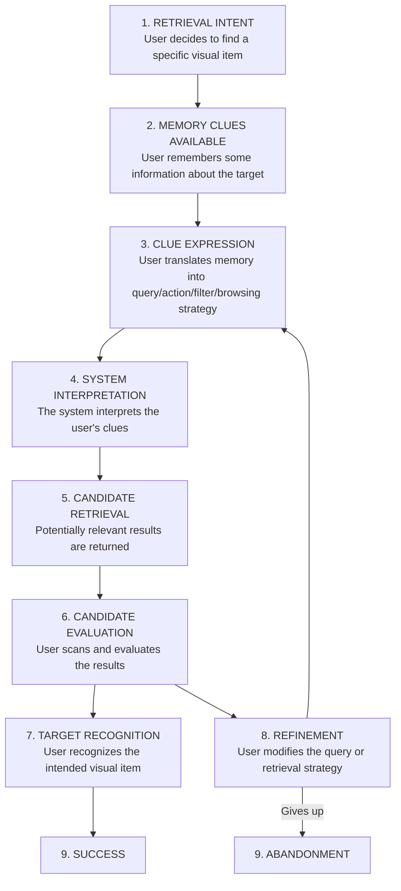
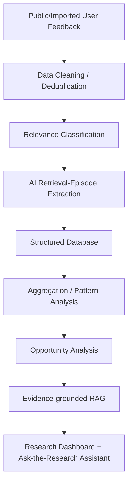

# Google Photos — AI-Powered Discovery Engine for Vaguely Remembered Photo Retrieval

---

## 1. Project Context

**Team:** Core Experience, Google Photos

Over years of usage, users accumulate thousands of photos, videos, screenshots, documents, receipts, memes, product images, and other visual memories in Google Photos. Google Photos search works well when users know what they are looking for and can express it clearly. However, **retrieval becomes much harder when memory is incomplete**.

### Example Scenarios

- *"That small café we went to during our Goa trip."*
- *"The picture of the medicine I took when I was sick last year."*
- *"The screenshot of a dress I wanted to buy a few months ago."*
- *"That photo with my college friends at some wedding."*
- *"The receipt I photographed when I bought my laptop."*

### What Users May NOT Remember

| Forgotten Attribute       | Example                          |
|---------------------------|----------------------------------|
| When it was taken         | Exact date/time                  |
| Where it was taken        | Exact location                   |
| Exact object/name         | Medicine name, café name         |
| Album it belongs to       | Which album or folder            |
| Exact words in the image  | Text on a receipt or screenshot  |
| Exact person involved     | Who was in the photo             |
| Filename                  | File or image name               |
| Source of a screenshot     | Which app it came from           |
| Exact event               | Which wedding, which trip        |
| Exact sequence of events  | Timeline of related photos       |

### What Users May Still Retain (Partial Memories)

- What was happening
- Who they were with
- Why they took the photo
- What the image roughly looked like
- An approximate place or time
- What happened before or after
- An emotional or situational context
- A life event
- A visual characteristic
- The purpose of the photo

### Strategic Goal

> **INCREASE THE PERCENTAGE OF USERS WHO SUCCESSFULLY RETRIEVE A PHOTO THEY REMEMBER BUT CANNOT PRECISELY DESCRIBE WHEN THEY START SEARCHING.**

> [!IMPORTANT]
> This project is **NOT** about improving Google Photos search in general. It is specifically about understanding how people remember and retrieve old visual information when memory is incomplete.

### Core Understanding Goals

1. How people remember old visual information
2. What information remains in memory
3. What information has been forgotten
4. How users attempt to translate incomplete memory into searches
5. Where the retrieval journey breaks
6. What users do after a failed search
7. What workarounds they use
8. Which retrieval problems represent meaningful product opportunities

---

## 2. Primary Project Objective

Build an **AI-powered discovery engine** that analyzes publicly available user conversations about photo and visual-item retrieval at scale.

### The Engine Must Go Beyond

- Sentiment analysis
- Keyword frequency
- Generic review summarization
- Positive/negative classification
- Generic complaints about Google Photos

### The Engine Must Convert Messy Public Conversations Into Structured Behavioral Evidence

```
WHAT USERS REMEMBER
        +
WHAT USERS FORGET
        +
WHAT THEY TRY
        +
WHERE RETRIEVAL FAILS
        +
WHAT THEY DO NEXT
        +
WHICH PROBLEMS MAY REPRESENT PRODUCT OPPORTUNITIES
```

### Key Questions the System Should Help Answer

- What kinds of old visual items do users struggle to retrieve?
- What clues do users still remember?
- What information have they forgotten?
- How do users formulate searches when memory is incomplete?
- Which remembered clues fail to make it into users' search queries?
- Which clues appear to be poorly understood by the current retrieval experience?
- What happens after the first failed attempt?
- How do users refine searches?
- When do users manually browse instead?
- When do users abandon retrieval?
- What workarounds do users use?
- Do retrieval problems differ for screenshots, travel photos, documents, medicine photos, receipts, or emotional memories?
- Which retrieval failure modes appear most common or severe?
- Which opportunity areas deserve further validation through primary user interviews?

---

## 3. Core Research Question

> *"When people know that a visual item exists but cannot precisely describe it, what information do they still remember, what information have they forgotten, and where does the retrieval process fail despite those remaining memories?"*

---

## 4. Definition of a Vaguely Remembered Visual Item

> A visual item that a user believes exists in their library and can recall through one or more partial contextual, semantic, visual, emotional, temporal, relational, or situational clues, but cannot precisely identify using known metadata or an exact search query.

### Visual Item Types

| Type                    | Examples                               |
|-------------------------|----------------------------------------|
| Photos                  | Camera photos, selfies                 |
| Videos                  | Recorded clips                         |
| Screenshots             | App screenshots, web captures          |
| Photographed documents  | ID cards, certificates                 |
| Receipts                | Purchase receipts, bills               |
| Medicine/product photos | Medicine strips, product labels        |
| Memes                   | Saved/shared memes                     |
| Travel memories         | Trip photos, landmark shots            |
| Signs                   | Road signs, menus, notices             |
| Event photos            | Wedding, graduation, festival photos   |
| Saved visual references | Inspiration images, wish-list items    |

---

## 5. Definition of Successful Retrieval

**A retrieval attempt begins when:** A user intentionally tries to locate a specific visual item that they believe exists, but they cannot precisely locate or describe it at the beginning of the attempt.

**A retrieval attempt may involve:**
- Multiple searches
- Query reformulation
- Scrolling / filtering
- Navigating by date, person, or place
- Switching strategies
- Using another application
- Asking another person
- Other workarounds

**Successful retrieval occurs when:** The user identifies the intended visual item, or an acceptable version of the intended item, during the retrieval attempt.

> [!NOTE]
> Showing search results alone does **NOT** count as successful retrieval.

---

## 6. Project Scope

### In Scope

Cases where:
- The user believes a specific visual item exists
- The user is intentionally trying to retrieve it
- Their memory is incomplete
- They retain at least one useful clue
- Retrieval requires searching, browsing, refinement, reconstruction, or a workaround

**Examples:**
- Finding an old medicine photo without knowing its name or date
- Retrieving a café photo from a trip without remembering the café name
- Finding an old screenshot without remembering when it was taken
- Finding a photo from an event without remembering the exact event date
- Locating a photographed receipt using approximate context
- Finding a visual item based on what happened before or after it

### Out of Scope

> [!WARNING]
> Do **not** treat the following as vague-memory retrieval problems unless a separate relevant retrieval episode is also present:

- Backup failure
- Photo deletion
- Sync problems
- Storage complaints
- Editing / sharing problems
- Account access
- Upload failures
- Duplicate management
- Generic application performance complaints
- Casual browsing
- Memory/recommendation features
- Retrieving a photo when the user already knows the exact date/location
- General Google Photos search complaints without evidence of an actual vague-memory retrieval scenario

---

## 7. Retrieval Journey Model



> [!NOTE]
> This framework is a **starting hypothesis**. The discovery engine must allow additional behaviors or failure stages to emerge from the evidence.

---

## 8. Initial Failure-Mode Taxonomy

| Failure Mode | Description | Example |
|---|---|---|
| **A. Expression Failure** | User remembers useful info but cannot translate it into an effective search | Memory: *"We went to this café after parasailing near the beach"* → Query: *"Goa café"* |
| **B. Interpretation Failure** | User provides useful clues but the system cannot understand, combine, or correctly use them | *"Photo of the medicine I took when I had fever last year"* |
| **C. Candidate Retrieval Failure** | The intended item or sufficiently relevant candidates do not appear | No relevant results shown |
| **D. Recognition Failure** | Correct results may be available but user struggles to identify the target among many similar results | Too many visually similar thumbnails |
| **E. Refinement Failure** | First attempt fails and user does not know how to improve the retrieval attempt | User repeats similar queries with no progress |
| **F. Other / Emerging Failure** | A meaningful failure mode not represented by the existing framework | To be discovered from data |

> [!IMPORTANT]
> A single retrieval episode may contain **multiple failure modes**. The system should distinguish: earliest failure, primary failure, and secondary failures.

---

## 9. Memory-Clue Taxonomy

For each retrieval episode, identify what the user still remembers.

| Clue Category | Description |
|---|---|
| **Object / Content** | What appears in the image |
| **People** | Who appears in or relates to the image |
| **Location** | Approximate or precise geographic/environmental context |
| **Approximate Time** | e.g., last winter, during college, two years ago |
| **Event** | Wedding, vacation, festival, party, graduation, etc. |
| **Visual Attributes** | Colors, objects, layout, clothing, setting, shape |
| **Purpose / Intention** | Why the user took or saved the visual item |
| **Activity** | What the user or others were doing |
| **Sequence** | What occurred immediately before or after the item |
| **Relationship** | Relationship between people, places, events, or activities |
| **Life Event** | Broader personal milestone or period |
| **Emotional / Contextual** | How the moment felt or why it was personally memorable |
| **Source** | Screenshot, WhatsApp, Instagram, camera, downloaded image, etc. |
| **Text** | Partial remembered text inside the image |
| **Other** | Clue not covered above |

> The system must allow multiple clues per retrieval episode. Whenever possible, preserve evidence supporting each clue.

---

## 10. Forgotten-Information Taxonomy

Identify what the user appears **not** to know or remember.

- Exact date / time
- Exact location / place name
- Object name / medicine/product name
- Person's identity
- Exact event
- Filename / album / folder
- Source application / screenshot origin
- Exact wording
- Sequence/date relationship / chronology
- Other

> [!CAUTION]
> Do **not** infer forgotten information without evidence.

---

## 11. Public Data Sources

The engine should support user-feedback data from publicly available sources:

- Reddit
- Google Photos Community / Help discussions
- Google Play Store reviews
- Apple App Store reviews
- YouTube comments
- Public forums
- Public social-media conversations
- Blogs or other relevant public discussions

### Minimum Support Requirements

- Importing structured CSV/JSON data
- Importing manually collected public feedback
- Preserving source URLs, source platform, and raw text

> [!IMPORTANT]
> The system must **never invent source data**.

---

## 12. Raw Data Requirements

Each source record should support:

| Field              | Description                                      |
|--------------------|--------------------------------------------------|
| `record_id`        | Unique identifier                                |
| `platform`         | Source platform name                             |
| `source_url`       | Link to original content                         |
| `date_posted`      | Date the content was posted                      |
| `author`           | Author identifier (if publicly available)        |
| `title`            | Title if present                                 |
| `raw_text`         | Full raw text of the post/review                 |
| `thread_context`   | Surrounding thread/conversation context          |
| `imported_at`      | Timestamp of import                              |
| `collection_method`| How the data was collected                       |

> Personal identifiers should not be required for the research.

---

## 13. Relevance Classification

Every collected record must first pass through a **relevance classifier**.

A record is relevant when it contains meaningful evidence of a vaguely remembered visual retrieval scenario.

**The classifier should determine:**
- `relevant`: true/false
- `confidence`
- `reason`
- `retrieval_target` (if visible)
- Evidence of vague/incomplete memory

> The system should filter generic complaints before downstream analysis.

---

## 14. Structured Retrieval-Episode Extraction

For each relevant record, create a structured **retrieval episode** containing:

### Source Information
- `episode_id`, `record_id`, `platform`, `source_url`, `raw_text`

### Target
- `visual_item_type`, `retrieval_goal`, `why_user_needs_item`

### Memory
- `remembered_clues`, `clue_categories`, `supporting_evidence`, `confidence`

### Forgotten Information
- `forgotten_attributes`, `evidence`, `confidence`

### Search / Retrieval Behavior
- `initial_query`, `subsequent_query`, `search_method`, `filters_used`
- `browsing_behavior`, `scrolling_behavior`, `strategy_changes`, `refinement_attempts`

### Failure
- `earliest_failure_stage`, `primary_failure_mode`, `secondary_failure_modes`
- `confidence`, `evidence`, `reasoning`

### Workaround
- Manual scrolling, browsing by date/location/person, checking albums
- Searching another app, checking messages, asking another person
- Searching cloud/device folders, Google Search, giving up, other

### Outcome
- `success` / `partial_success` / `failure` / `abandoned` / `unknown`

### Impact
- Functional or emotional retrieval
- Urgency, frustration, consequence (if supported)

> [!CAUTION]
> **Never invent behavior** that is not visible in the source.

---

## 15. Observation vs Inference

> [!IMPORTANT]
> This is a **critical requirement**.

The discovery engine must clearly distinguish:

| Level | Description |
|---|---|
| **A. Observed Evidence** | Directly supported by user language or behavior |
| **B. AI Interpretation** | A reasonable interpretation based on the evidence |
| **C. Hypothesis** | A possible explanation that requires more validation |

The interface and generated insights should **not** present hypotheses as facts.

---

## 16. Pattern-Discovery Requirements

The engine must analyze retrieval episodes across multiple dimensions:

- Remembered clue frequency
- Forgotten-information frequency
- Remembered × forgotten combinations
- Failure mode frequency
- Retrieval target × failure mode
- Clue type × failure mode
- Workaround × outcome
- Search behavior × success
- Refinement behavior × success
- Emotional vs functional retrieval
- Target type × remembered clue
- Target type × workaround
- Platform/source distribution

### Example Hypotheses (Do Not Force)

- Users may remember purpose but not object name
- Users may remember event but not date
- Users may possess contextual clues but omit them from search queries
- Screenshot retrieval may fail differently from travel-memory retrieval
- Users may abandon after repeated keyword reformulation
- Target recognition may be difficult even when candidate retrieval succeeds

---

## 17. Opportunity Discovery

The discovery engine should identify **distinct** product opportunity areas.

> [!WARNING]
> It must **NOT** collapse everything into: *"Users have difficulty finding old photos."*

### Each Opportunity Should Describe

- Retrieval scenario & target type or user behavior
- Remembered information & forgotten information
- Failure stage & observed behavior
- Current workaround & outcome
- Root-cause hypothesis
- Evidence count & source diversity
- Severity/friction & abandonment (if visible)
- Evidence confidence & uncertainty
- Potential relevance to retrieval success

### Comparison Dimensions

| Dimension | Description |
|---|---|
| Prevalence | How often this problem appears |
| Severity | How badly it impacts the user |
| Friction | How much effort the user expends |
| Abandonment | How often users give up |
| Workaround cost | How costly the workaround is |
| Breadth | How many user types it affects |
| Evidence strength | How well-supported the finding is |
| Likely AI leverage | How much AI could help |
| Business metric relevance | How it connects to retrieval success rate |

> **Frequency alone must NOT determine opportunity importance.**

---

## 18. Root-Cause Analysis

For every meaningful problem area, distinguish:

| Component | Description |
|---|---|
| **Symptom** | What users say went wrong |
| **Behavior** | What users actually did |
| **Memory State** | What information they retained |
| **System / Interaction Gap** | Why retained info did not contribute to retrieval |
| **Root-Cause Hypothesis** | Deepest explanation supported by current evidence |
| **Alternative Explanations** | Other plausible causes |
| **Evidence Strength** | Strong / moderate / weak |

> Do not automatically interpret every failure as a search-ranking problem.

---

## 19. Dashboard Requirements

Build a simple but polished research dashboard.

### A. Overview
- Total imported records, relevant retrieval episodes, irrelevant/excluded records
- Number of platforms
- Visual-item-type distribution, retrieval-outcome distribution
- Key dataset statistics

### B. Memory Explorer
- Most common remembered clues & forgotten information
- Remembered × forgotten combinations
- Clue patterns by target type

### C. Failure Explorer
- Failure mode distribution
- Failure by visual-item type, clue type, and outcome
- Primary vs secondary failure

### D. Behavior Explorer
- Search strategies, refinements, workarounds
- Abandonment patterns, strategy changes

### E. Opportunity Explorer
- Distinct retrieval opportunity areas
- Allow users to compare opportunities using evidence

### F. Evidence Explorer
- Raw conversation, extracted episode
- Remembered clues, forgotten attributes, failure classification
- Workaround, outcome, source URL
- AI reasoning/confidence where appropriate

### G. Ask the Research
Natural-language research query interface.

**Example queries:**
- *"What do users remember when trying to find travel photos?"*
- *"What clues do users possess but fail to express?"*
- *"Compare screenshot retrieval with travel-photo retrieval."*
- *"What happens after the first failed search?"*
- *"Which problems lead to abandonment?"*
- *"Show evidence for recognition failure."*
- *"What workarounds do users use for old screenshots?"*
- *"Which findings are supported across multiple platforms?"*

> Responses must be grounded **only** in the dataset.

---

## 20. AI Research Assistant Requirements

The "Ask the Research" feature must use **grounded retrieval / RAG** or an equivalent evidence-grounding mechanism.

### For Each Response

1. State the finding
2. Quantify supporting evidence where possible
3. Explain relevant user behavior
4. Provide representative evidence
5. Provide source links
6. Mention contradictory evidence when present
7. State confidence
8. Separate evidence from interpretation

> [!CAUTION]
> **Never:**
> - Fabricate user quotes
> - Fabricate source links
> - Fabricate counts
> - Use external general knowledge as if it came from the dataset

---

## 21. Insight Requirements

Every major generated insight should ideally include:

- Insight statement
- Number of supporting retrieval episodes
- Percentage of relevant dataset (if appropriate)
- Source diversity
- Relevant segment
- Supporting evidence & representative snippets
- Links to source conversations
- Contradictory evidence
- Interpretation & confidence
- Research limitation

> Insights should remain **traceable** back to individual evidence records.

---

## 22. Quality / Bias Checks

The system should support checks for:

- Duplicate conversations / repeated cross-posts
- Unsupported AI claims / small-sample conclusions
- Irrelevant records included as retrieval episodes
- Sentiment being interpreted as severity
- Complaint frequency being interpreted as opportunity size
- Hypotheses being presented as facts
- Source overrepresentation
- AI-generated quotes
- Broken/missing source URLs
- Overlapping opportunity categories
- Premature solution bias

---

## 23. Business-Metric Connection

**Target Metric:** Vaguely Remembered Retrieval Success Rate

### Conceptual Retrieval Funnel

```
Retrieval intent
    → useful memory clues
        → clue expression
            → system interpretation
                → candidate retrieval
                    → candidate evaluation
                        → target recognition
                            → refinement
                                → retrieval success
```

The engine should help identify where the **largest or most meaningful opportunity** may exist. It should **NOT** assume the final solution.

---

## 24. Important Product-Research Principles

1. Do **not** start with a predetermined solution
2. Do **not** assume conversational search is the answer
3. Do **not** assume natural-language understanding is the primary problem
4. Do **not** treat user complaints as root causes
5. Do **not** treat sentiment as product opportunity
6. Do **not** treat frequency alone as importance
7. **Preserve** contradictory evidence
8. **Preserve** source traceability
9. **Distinguish** observation from interpretation
10. **Allow** new categories to emerge from data
11. Keep the discovery engine focused on **behavior, memory, retrieval failures, and workarounds**

---

## 25. Target Users of the Discovery Engine

**Primary user:** Product Manager / Product Researcher

The system should help the PM:

- Explore real-user evidence
- Understand retrieval behavior
- Identify patterns
- Compare different retrieval problems
- Form research hypotheses
- Select areas for user interviews
- Make evidence-based product decisions

> [!NOTE]
> The tool is **NOT** intended to be a production Google Photos feature. It is a **research/discovery tool**.

---

## 26. UX Requirements

The application should be:

- Clear, professional, research-oriented
- Easy to demo, visually polished
- Simple enough to understand quickly

**Guidelines:**
- Avoid unnecessary complexity
- Make the evidence-to-insight relationship obvious
- Use charts only where they improve comprehension
- Tables, filters, evidence cards, and drill-downs are encouraged
- Every important insight should be explorable down to supporting evidence

---

## 27. Technical Requirements

### Preferred High-Level Architecture



### Implementation Priorities

- Simplicity
- Explainability
- Deployability
- Evidence traceability
- Fast iteration

> The entire architecture should be explainable on **one presentation slide**.

---

## 28. Data Storage

The data model should preserve at least **three layers**:

| Layer | Purpose |
|---|---|
| **Layer 1 — Raw Source Data** | Original imported conversations |
| **Layer 2 — Structured Retrieval Episodes** | AI-extracted behavioral information |
| **Layer 3 — Generated Insights / Opportunities** | Aggregated patterns linked back to supporting episodes |

> [!CAUTION]
> **Never** overwrite raw source text with AI-generated data.

---

## 29. Deployment Requirement

The final discovery engine should be deployed through a **publicly accessible link**.

Another person should be able to:
- Open the application
- Explore the dataset
- Inspect findings & view evidence
- Compare opportunity areas
- Ask research questions

> Do **not** expose private API keys or sensitive credentials.

---

## 30. Project Deliverables This Engine Supports

1. **Public link** to the AI-Powered Discovery Engine

2. **One presentation slide** explaining:
   - Data sources → Processing pipeline → AI analysis → Structured evidence → Dashboard → RAG/research assistant

3. **Discovery findings** that will inform:
   - Target user segment
   - User interview design
   - Retrieval scenarios
   - Opportunity selection
   - Root-cause hypotheses
   - Final problem definition

> [!IMPORTANT]
> The discovery engine is **NOT** itself the final Google Photos solution. A separate user-facing AI-native MVP will be created later after research and problem definition.

---

## 31. Relationship to User Interviews

The discovery engine produces **hypotheses**. These hypotheses will later be validated through 5–6 user interviews.

The engine should produce a final synthesis divided into:

| Category | Description |
|---|---|
| **What We Know** | Strongly supported observational evidence |
| **What We Think** | Interpretations and root-cause hypotheses |
| **What We Still Need to Validate** | Questions for primary user research |

---

## 32. Initial Acceptance Criteria

The discovery engine is considered functionally complete when:

1. ✅ Public user-feedback records can be imported
2. ✅ Relevant retrieval conversations can be separated from irrelevant feedback
3. ✅ Relevant records are transformed into structured retrieval episodes
4. ✅ The engine identifies: remembered clues, forgotten information, retrieval behavior, failure modes, workarounds, outcomes
5. ✅ Users can explore aggregated patterns
6. ✅ Users can compare at least several distinct retrieval opportunity areas
7. ✅ Every major insight can be traced back to source evidence
8. ✅ Users can inspect raw source conversations
9. ✅ Users can ask natural-language questions about the research dataset
10. ✅ AI answers remain grounded in the available research records
11. ✅ Unsupported questions are clearly marked as lacking sufficient evidence
12. ✅ The application is deployable through a public URL
13. ✅ The architecture is simple enough to explain clearly on one slide

---

## 33. Design.md Expectation

Based on this problem statement, `design.md` should define:

- Overall architecture & chosen technology stack
- Component architecture & user flows
- Page/dashboard structure
- Database/data model
- AI processing pipeline
- Prompt/agent architecture
- Relevance-classification logic
- Retrieval-episode extraction logic
- Pattern-discovery logic & opportunity-generation logic
- RAG architecture & citation/evidence architecture
- Deduplication strategy
- Error handling & security/API-key handling
- Deployment architecture
- UX design & testing strategy

---

## 34. Implementation.md Expectation

After `design.md` is finalized, `implementation.md` should divide the build into small sequential phases.

Each phase should include: objective, files/components to create, implementation tasks, expected output, test/validation criteria, dependencies, definition of done.

### Recommended Phase Sequence

| Phase | Focus |
|---|---|
| 1 | Project setup and basic UI |
| 2 | Database/data model |
| 3 | Data import |
| 4 | Cleaning and deduplication |
| 5 | Relevance classifier |
| 6 | Retrieval-episode extraction |
| 7 | Dashboard analytics |
| 8 | Evidence explorer |
| 9 | Pattern discovery |
| 10 | Opportunity explorer |
| 11 | Ask-the-Research RAG |
| 12 | Insight quality checks |
| 13 | Demo dataset / validation |
| 14 | Deployment |
| 15 | Final QA |

> Implementation should be incremental — each phase completed and tested before moving to the next.

---

## 35. Final Instruction

1. Read and understand this entire problem statement
2. Create **only** `design.md` and `implementation.md`
3. Do **not** begin coding yet
4. Do **not** prematurely select a final Google Photos product solution

> **The immediate goal is to build a rigorous AI-powered discovery system that helps uncover and compare vague-memory retrieval problems using traceable real-user evidence.**
